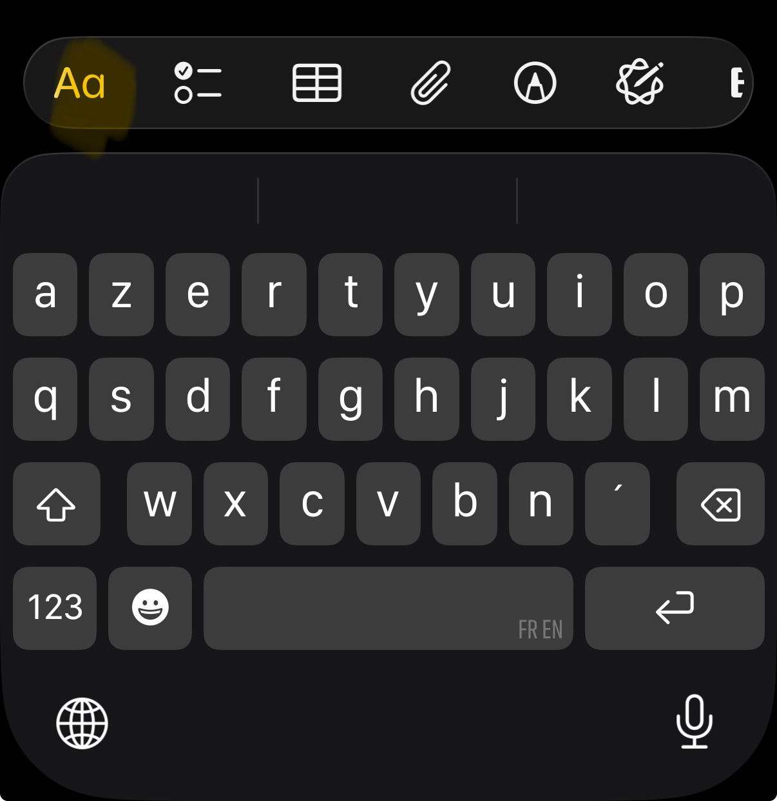
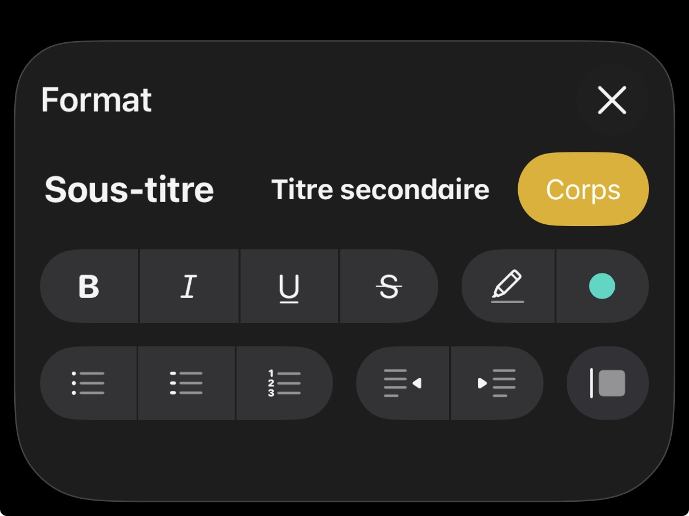
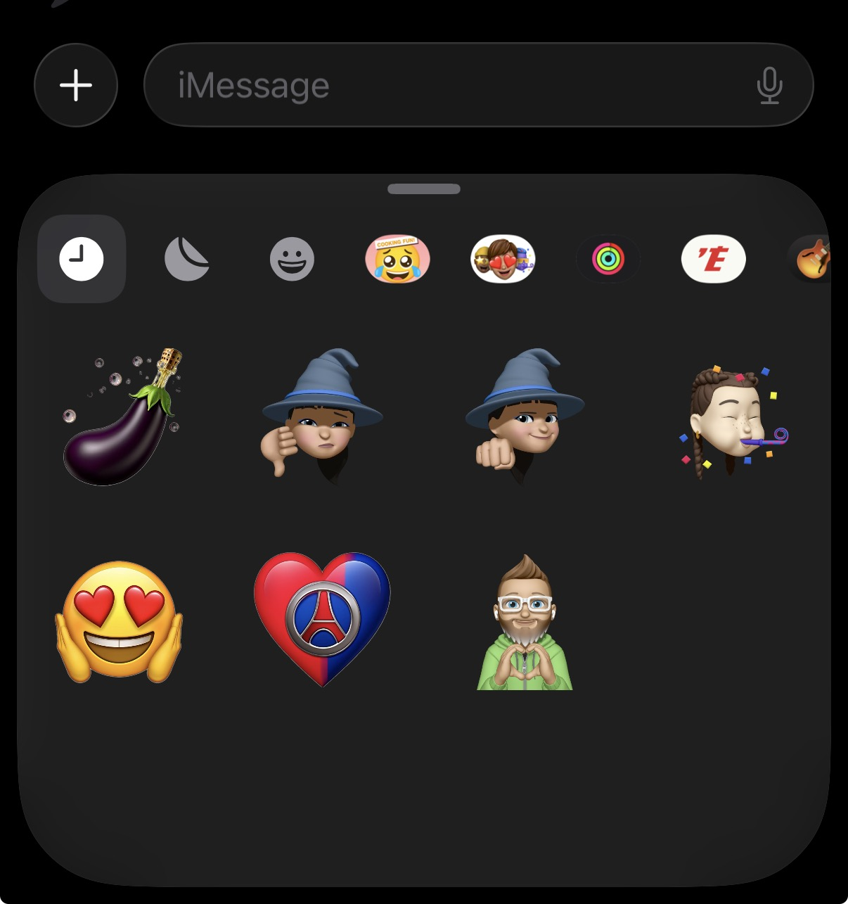

# Spécification fonctionnelle et technique — Application iOS d’albums photo et vidéo

> **Version :** 2.1<br>
> **Date :** 27 juillet 2026  
> **Statut :** prêt pour développement — validation iPad temporaire<br>
> **Plateformes :** iPhone et iPad  
> **Version minimale :** iOS 26 et iPadOS 26  
> **Technologies principales :** Swift et SwiftUI

---

## 0. Règles de lecture du document

Les termes suivants ont une valeur normative :

- **DOIT** : exigence obligatoire pour la version ou le lot indiqué.
- **NE DOIT PAS** : comportement interdit.
- **DEVRAIT** : recommandation forte qui peut être écartée uniquement pour une raison technique documentée.
- **PEUT** : comportement facultatif.

Chaque exigence fonctionnelle, technique, de sécurité, de performance ou d’accessibilité possède un identifiant stable. Les tests, procédures de validation et pull requests doivent citer les identifiants concernés. Une exigence sans identifiant n’est pas normative.

Les règles de développement suivantes sont normatives :

1. `DEV-001` — Ne pas remplacer une exigence par un comportement supposé plus simple sans le documenter.
2. `DEV-002` — Ne pas utiliser d’API privée Apple.
3. `DEV-003` — Utiliser en priorité les API publiques d’iOS 26. Une garde de disponibilité n’est requise que pour une API introduite après iOS 26.
4. `DEV-004` — Conserver les données de l’utilisateur avant toute considération esthétique.
5. `DEV-005` — Implémenter l’application selon une architecture locale d’abord avec synchronisation différée.
6. `DEV-006` — Écrire les tests du domaine avant ou en même temps que les fonctionnalités correspondantes.
7. `DEV-007` — Une exigence impossible à vérifier dans l’environnement disponible DOIT conserver l’état `BLOQUÉ` ou `NON TESTÉ` ; elle NE DOIT PAS être considérée comme réussie, abandonnée ou implicitement hors périmètre.
8. `DEV-008` — Chaque campagne manuelle sur iPad DOIT enregistrer le commit, la build ou copie testée, l’appareil, les versions d’iPadOS et de Swift Playgrounds, les scénarios exécutés, les résultats, les preuves, les anomalies et les contrôles non exécutés.
9. `DEV-009` — La phase temporaire sans macOS/Xcode PEUT produire des prototypes et builds internes, mais elle NE DOIT PAS autoriser une publication publique.

---

# 1. Objectif du produit

L’application permet à un utilisateur de créer des albums personnalisés composés de pages contenant :

- une photo, une image animée ou une vidéo
- un commentaire enrichi placé sous le média
- des stickers placés librement en surimpression
- un fond graphique commun à l’ensemble de l’album

À partir de la version 1.1, un album créé sur un iPhone peut être ouvert et modifié sur un autre iPhone ou sur un iPad par CloudKit. Dès la version 1.0, il peut être transféré manuellement par package, consulté en lecture seule, présenté en diaporama et exporté en PDF.

L’application suit quatre principes principaux :

- **locale d’abord** : l’édition reste possible sans connexion
- **non destructive** : le cadrage et les transformations ne modifient pas le média original importé
- **portable** : un package exporté contient toutes les ressources nécessaires
- **résiliente** : les opérations suivent les garanties transactionnelles de la section 18

---

# 2. Périmètre et stratégie de livraison

## 2.1 Positionnement

L’application vise en priorité les albums de voyage et les journaux illustrés. La promesse de la première version publique est la suivante :

> Créer localement un album photo ou vidéo, le personnaliser avec du texte enrichi et des stickers, le consulter et l’exporter sous une forme portable.

Les parcours prioritaires sont, dans cet ordre :

1. créer un album et gérer ses pages
2. ajouter des photos et vidéos
3. écrire et mettre en forme un commentaire
4. placer et transformer des stickers
5. choisir une couverture
6. consulter l’album en lecture seule
7. lancer un diaporama
8. exporter un PDF ou un package modifiable

## 2.2 Versions publiques et lots internes

Les lots sont des incréments internes ou TestFlight. Chaque lot laisse le projet compilable, testable et démontrable. Une version publique n’est produite qu’après passage du lot Qualité applicable.

| Version | Lots inclus | Périmètre public |
|---|---|---|
| `1.0` | Lots 0 à 3 et qualité associée | Création locale, vidéo, commentaires enrichis de base, stickers personnalisés, lecture, diaporama, animation de page, PDF et package modifiable |
| `1.1` | Lot 4 et qualité associée | Tableaux et listes de contrôle, historique persistant, synchronisation CloudKit et résolution de conflits |
| `1.2` | Lot 5 et qualité associée | Import de photos et vidéos depuis Google Photos |

Le format de données local est conçu dès le lot 0 pour accueillir les fonctions des versions 1.1 et 1.2 sans migration destructive.

## 2.3 Fonctionnalités de la version publique 1.0

- bibliothèque de plusieurs albums
- création, renommage, corbeille et restauration d’un album
- couverture automatique ou manuelle
- ajout, suppression, restauration pendant la session et réorganisation des pages
- une page minimum par album
- un emplacement photo, image animée ou vidéo par page
- cadrage non destructif avec zoom et déplacement
- commentaire enrichi avec styles de paragraphes et de caractères, couleurs, surlignage, listes, retraits et alignement
- brouillon récupérable de commentaire
- stickers intégrés et personnalisés créés depuis une image ou un GIF
- déplacement, rotation, redimensionnement et ordre d’affichage des stickers
- affichage d’une page ou de deux pages
- navigation par boutons et balayage avec animation de page tournée
- lecture seule et diaporama
- annulation et rétablissement pendant la session courante
- stockage local transactionnel
- import depuis la photothèque Apple
- export et import d’un package modifiable
- export en PDF
- fonctionnement en portrait et en paysage
- accessibilité, clavier, pointeur et trackpad sur iPad

## 2.4 Fonctionnalités ajoutées en version 1.1

- listes de contrôle
- tableaux
- historique persistant de cinquante révisions par album
- synchronisation CloudKit locale d’abord
- téléchargement à la demande des médias
- fusion automatique des modifications portant sur des pages différentes
- conservation et résolution explicite des versions concurrentes d’une même page
- corbeille synchronisée pendant trente jours

## 2.5 Fonctionnalités ajoutées en version 1.2

- connexion Google
- import d’une photo ou d’une vidéo par opération avec Google Photos Picker API
- reprise des téléchargements Google interrompus

## 2.6 Fonctionnalités hors périmètre

`SCP-001` — Les fonctionnalités suivantes sont explicitement hors périmètre des versions 1.0 à 1.2 :

- collaboration simultanée entre plusieurs personnes
- partage public d’un album sur un site Web
- réseau social, commentaires externes ou réactions
- commande d’impression
- application Android ou Web
- montage vidéo
- filtres photo avancés
- musique de fond du diaporama
- plusieurs cadres média sur une même page
- duplication d’une page
- duplication d’un album
- capture directe depuis l’appareil photo
- lecture de la bibliothèque privée de stickers de Messages
- pièces jointes et dessins dans le commentaire
- serveur applicatif propriétaire
- commentaire audio
- chiffrement ou protection par mot de passe d’un package exporté
- fusion avec un album existant lors de l’import d’un package

## 2.7 Applicabilité des exigences

| ID | Exigence |
|---|---|
| `REL-001` | Une exigence sans mention de version DOIT s’appliquer dès la version 1.0 et rester applicable aux versions suivantes. |
| `REL-002` | Une mention de version dans un titre de section DOIT s’appliquer à toutes les exigences de cette section, sauf indication plus précise. |
| `REL-003` | La version 1.1 DOIT hériter de toutes les exigences 1.0 et la version 1.2 de toutes les exigences 1.0 et 1.1. |
| `REL-004` | Les préfixes `CHK`, `TBL`, `HIS`, `SYN`, `ICL` et `CNF` DOIVENT entrer en vigueur en version 1.1. |
| `REL-005` | Le préfixe `GPH` DOIT entrer en vigueur en version 1.2. |

## 2.8 Stratégie temporaire de validation sans Mac

Le projet suit deux phases d’environnement distinctes. Cette organisation
modifie le moment où certaines preuves sont obtenues, mais elle ne réduit pas
le périmètre fonctionnel ni les critères de qualité.

### Phase A — développement progressif et validation manuelle sur iPad

Cette phase est retenue tant que le travail est effectué de manière
occasionnelle sans accès rentable à un Mac :

1. le code est écrit et versionné depuis Windows, VS Code et WSL ;
2. GitHub reste l’unique source de vérité ;
3. l’App Playground est compilé et exécuté sur l’iPad ;
4. les premières versions sont des prototypes ou builds internes ;
5. chaque session disponible exécute la campagne manuelle de la section 30.5 ;
6. les contrôles indisponibles sont inscrits dans le registre de validation
   différée, sans être marqués comme réussis.

| ID | Exigence |
|---|---|
| `ENV-001` | Le rythme intermittent de la phase A NE DOIT PAS imposer la location continue d’un Mac ; les validations macOS/Xcode DOIVENT être regroupées dans une campagne ultérieure. |
| `ENV-002` | Chaque contrôle d’un commit candidat testé sur iPad DOIT avoir un résultat reproductible dans le suivi : `RÉUSSI`, `ÉCHOUÉ`, `BLOQUÉ`, `NON TESTÉ` ou `NON APPLICABLE`. |
| `ENV-003` | Une fonction dépendant d’une capacité absente de Swift Playgrounds, notamment une configuration CloudKit, un type de document exporté ou un retour OAuth, DOIT rester bloquée jusqu’à une preuve sur un environnement compatible. |
| `ENV-004` | Un parcours réussi sur iPad NE DOIT PAS être extrapolé à l’iPhone, aux simulateurs, à la signature de distribution, aux tests automatisés Apple, à Instruments ou à l’accessibilité du PDF. |
| `ENV-005` | Les sources, ressources et configurations générées par Swift Playgrounds DOIVENT rester versionnées et préparées pour une ouverture ou migration déterministe dans Xcode. |

Une **version viable sur iPad** est un jalon interne, et non une version
publique. Elle doit permettre, sur un même commit, de créer un album, ajouter
au moins une photo et une vidéo, modifier un commentaire et un sticker, fermer
et relancer l’application sans perte, lire l’album, lancer le diaporama et
effectuer les exports réellement disponibles. Toute étape non encore
implémentée ou bloquée est explicitement listée.

### Phase B — qualification ponctuelle avec macOS et Xcode

Dès qu’une version viable sur iPad existe, ou plus tôt si un blocage empêche
de progresser, une session ponctuelle sur un Mac local, prêté, distant ou
hébergé doit être organisée. Elle n’a pas besoin d’être permanente ni
quotidienne.

| ID | Exigence |
|---|---|
| `ENV-006` | Avant toute publication publique, le commit candidat DOIT être ouvert et compilé avec la version de Xcode compatible avec les SDK ciblés. |
| `ENV-007` | La campagne macOS/Xcode DOIT exécuter la qualification différée de la section 30.6 et enregistrer ses preuves dans le suivi. |
| `ENV-008` | Toute correction réalisée pendant la campagne macOS/Xcode DOIT revenir dans GitHub et la campagne DOIT être relancée sur le nouveau commit candidat. |
| `ENV-009` | Si une capacité obligatoire reste impossible à signer, compiler ou tester, la version concernée NE DOIT PAS être publiée tant que le blocage n’est pas résolu ou que la spécification n’est pas explicitement révisée. |

---

# 3. Décisions produit validées

| ID | Décision retenue |
|---|---|
| `DEC-00` | Toute mention de « changement de pas » signifie « changement de page ». |
| `DEC-01` | L’application est développée en Swift et SwiftUI avec iOS 26 et iPadOS 26 minimum. |
| `DEC-02` | Les pages peuvent être ajoutées, supprimées et réorganisées. Elles ne peuvent pas être dupliquées. Un album contient toujours au moins une page. Il n’existe pas de limite fonctionnelle fixe au nombre de pages. |
| `DEC-03` | Le nom de l’album est obligatoire. La couverture utilise automatiquement le premier média de l’album. L’utilisateur peut choisir un autre média déjà présent dans l’album. |
| `DEC-04` | Un seul fond est appliqué à toutes les pages d’un album. |
| `DEC-05` | La préférence par défaut est l’affichage de deux pages. L’application force temporairement l’affichage d’une page si la largeur est insuffisante puis restaure la préférence lorsque l’espace redevient suffisant. |
| `DEC-06` | La navigation fonctionne avec des boutons et avec un balayage horizontal. |
| `DEC-07` | La photo ou la vidéo remplit le cadre avec recadrage. L’utilisateur peut déplacer et zoomer le contenu. |
| `DEC-08` | L’éditeur de commentaire reprend la logique visuelle de Notes avec une barre au-dessus du clavier et un panneau Format détaillé. Le périmètre exact est défini dans la section 12. |
| `DEC-09` | Le catalogue de stickers comporte des catégories, des récents et une recherche. L’utilisateur peut créer un sticker depuis une photo, une image ou un GIF. Le panneau est inspiré du menu Autocollants de Messages. |
| `DEC-10` | Google Photos utilise le sélecteur officiel avec `maxItemCount = 1` et importe un seul média par opération à partir de la version 1.2. |
| `DEC-11` | La durée du diaporama est globale par écran affiché. La progression suit le mode une page ou deux pages. La boucle est désactivée par défaut. Un écran reste affiché pendant le maximum entre la durée globale et la durée totale de ses vidéos. |
| `DEC-12` | L’export propose un package modifiable et un PDF. L’historique n’est pas inclus dans le package exporté. |
| `DEC-13` | À partir de la version 1.1, les pages et métadonnées indépendantes sont fusionnées automatiquement. Toute modification concurrente du même élément conserve toutes les branches et demande une résolution explicite. |
| `DEC-14` | À partir de la version 1.1, une révision est créée à la fin d’une session modifiée, après un renommage ou changement de couverture depuis la bibliothèque, et avant toute restauration. Les cinquante dernières révisions sont conservées. |
| `DEC-15` | Annuler et Rétablir couvrent uniquement la session d’édition courante. L’historique persistant couvre les sessions précédentes. |
| `DEC-16` | La suppression d’un album ou d’une page demande confirmation. La suppression d’un média ou d’un sticker ne demande pas confirmation mais reste annulable. |
| `DEC-17` | L’application fonctionne en portrait et en paysage. L’ordre de lecture est de gauche à droite dans les versions 1.0 à 1.2. |
| `DEC-18` | Une vidéo ne démarre pas automatiquement dans l’éditeur. Elle démarre sur pression avec les contrôles système, respecte le volume et le mode silencieux, et ne boucle pas. |
| `DEC-19` | La hauteur du commentaire est modifiable par l’utilisateur. |
| `DEC-20` | Les versions 1.0 à 1.2 contiennent un seul modèle de page. |
| `DEC-21` | Les lots sont des incréments internes ou TestFlight. La première version publique est la version 1.0 définie en section 2. |
| `DEC-22` | La synchronisation CloudKit, les conflits et l’historique persistant sont livrés en version 1.1. |
| `DEC-23` | Google Photos est livré en version 1.2. |
| `DEC-24` | Toute commande métier validée est persistée. Une interruption brutale peut perdre uniquement un geste ou les caractères pas encore journalisés ; le dernier brouillon journalisé est conservé. |
| `DEC-25` | La suppression d’un album le place dans une corbeille pendant trente jours avant suppression définitive. |
| `DEC-26` | Les réglages du diaporama sont globaux à l’application et non enregistrés dans chaque album. |
| `DEC-27` | Les tableaux et listes de contrôle sont différés à la version 1.1. |
| `DEC-28` | L’enveloppe de charge garantie est de cent pages, dix vidéos, cinq gigaoctets par album et vingt stickers par page. Un commentaire est limité fonctionnellement à cinq cents caractères. |
| `DEC-29` | Une seule fenêtre peut modifier un album donné à la fois. Une seconde fenêtre peut l’ouvrir en lecture seule. |
| `DEC-30` | Les documents `.photoalbum` sont des packages natifs Apple, documentés pour permettre leur lecture et leur création par des logiciels tiers. |

---

# 4. Terminologie

| Terme | Définition |
|---|---|
| **Album** | Document contenant un nom, un fond, une couverture, une liste ordonnée de pages et, à partir de la version 1.1, un historique. |
| **Page** | Canevas de composition contenant un cadre média, une zone de commentaire et une couche de stickers. |
| **Double page** | Affichage simultané de deux pages adjacentes dans l’ordre de lecture. |
| **Média** | Photo, image animée ou vidéo importée dans le stockage contrôlé par l’application. |
| **Placement média** | Paramètres non destructifs de zoom et de déplacement d’un média dans son cadre. |
| **Commentaire** | Document enrichi structuré en paragraphes et listes, puis en listes de contrôle et tableaux à partir de la version 1.1. |
| **Sticker** | Élément graphique intégré ou personnalisé placé au-dessus du reste de la page. |
| **Fond** | Thème graphique commun à l’ensemble des pages d’un album. |
| **Mode édition** | Mode permettant de modifier l’album. |
| **Mode lecture** | Mode épuré et non modifiable. |
| **Diaporama** | Navigation automatique entre les écrans de l’album. |
| **Révision** | Instantané persistant de l’état complet d’un album. |
| **Package d’album** | Document autonome et versionné qui peut être importé sur un autre appareil. |

---

# 5. Structure générale de l’application

## 5.1 Écrans obligatoires

1. Bibliothèque des albums
2. Création ou renommage d’un album
3. Éditeur d’album
4. Gestionnaire des pages
5. Sélecteur de source média
6. Éditeur de cadrage
7. Éditeur de commentaire
8. Sélecteur de stickers
9. Mode lecture
10. Paramètres du diaporama
11. Diaporama
12. Historique des révisions — version 1.1
13. Export
14. Import
15. Résolution de conflit CloudKit — version 1.1
16. Réglages de synchronisation — version 1.1
17. Réglages du compte Google — version 1.2

## 5.2 Navigation principale

| ID | Exigence |
|---|---|
| `APP-001` | La bibliothèque DOIT être l’écran racine. |
| `APP-002` | Une pression sur une carte DOIT ouvrir l’album en mode édition, sauf si cet album est déjà modifié dans une autre fenêtre ; la seconde fenêtre DOIT alors l’ouvrir en lecture seule. |
| `APP-003` | Le mode lecture DOIT être accessible depuis l’éditeur. |
| `APP-004` | Le diaporama DOIT être accessible depuis le mode lecture et depuis le menu de l’éditeur. |
| `APP-005` | Chaque commande métier validée DOIT être persistée sans attendre la fermeture de l’éditeur. |
| `APP-006` | Le retour vers la bibliothèque, le changement d’album et le passage en arrière-plan DOIVENT clore la session d’édition après enregistrement des commandes déjà validées. |
| `APP-007` | À partir de la version 1.1, la clôture d’une session modifiée DOIT créer une révision après réussite de la sauvegarde. |
| `APP-008` | Le passage en arrière-plan DOIT déclencher immédiatement la validation du journal local ; il NE DOIT PAS être considéré comme l’unique mécanisme de sauvegarde. |
| `APP-009` | Une terminaison brutale PEUT perdre le geste continu en cours, mais NE DOIT PAS perdre une commande déjà validée ni le brouillon courant d’un commentaire. |
| `APP-010` | Une ouverture en lecture seule causée par une autre fenêtre d’édition DOIT afficher la raison et proposer Réessayer lorsque le verrou d’édition est libéré. |
| `APP-011` | Le verrou d’édition DOIT être propre au processus et à l’album, être libéré à la fermeture de la scène et ne pas survivre à une relance de l’application. |

---

# 6. Bibliothèque et gestion des albums

## 6.1 Bibliothèque

| ID | Exigence |
|---|---|
| `ALB-001` | La bibliothèque DOIT afficher les albums sous forme de grille adaptative. |
| `ALB-002` | Chaque carte DOIT afficher la couverture, le nom et la date de dernière modification. |
| `ALB-003` | Les albums DOIVENT être triés par date de dernière modification décroissante par défaut. |
| `ALB-004` | Un bouton principal DOIT permettre de créer un album. |
| `ALB-005` | Une commande DOIT permettre d’importer un package d’album. |
| `ALB-006` | Une pression sur une carte DOIT ouvrir l’éditeur. |
| `ALB-007` | Un menu contextuel DOIT proposer Renommer, Choisir la couverture, Exporter et Supprimer. |
| `ALB-008` | La suppression d’un album DOIT afficher une confirmation explicite. |
| `ALB-009` | La bibliothèque DOIT posséder un état vide avec une action Créer un album et une action Importer. |
| `ALB-010` | Une miniature manquante ou en cours de génération NE DOIT PAS empêcher l’ouverture de l’album. |
| `ALB-017` | La suppression confirmée d’un album DOIT le déplacer dans une corbeille locale pendant trente jours. |
| `ALB-018` | La bibliothèque DOIT permettre d’ouvrir la corbeille, de restaurer un album et de le supprimer définitivement après confirmation. |
| `ALB-019` | Un album dans la corbeille NE DOIT PAS apparaître dans la bibliothèque principale et NE DOIT PAS être modifiable. |
| `ALB-020` | À l’expiration des trente jours, l’album DOIT être supprimé définitivement uniquement après validation durable du tombstone et vérification des références aux assets. |
| `ALB-021` | Renommer un album et changer sa couverture depuis la bibliothèque DOIVENT être annulables tant que l’utilisateur reste dans la bibliothèque. |
| `ALB-022` | À partir de la version 1.1, renommer un album ou changer sa couverture DOIT créer une révision persistante après validation. |
| `ALB-023` | L’expiration de la corbeille DOIT être évaluée au lancement et au moins une fois par jour lorsque l’application reste active. |
| `ALB-024` | La durée de rétention DOIT être calculée comme trente périodes de vingt-quatre heures à partir de `trashedAt` en UTC. |

## 6.2 Création

| ID | Exigence |
|---|---|
| `ALB-011` | La création DOIT demander un nom non vide après suppression des espaces en début et en fin. |
| `ALB-012` | Deux albums PEUVENT porter le même nom. |
| `ALB-013` | Un album nouvellement créé DOIT contenir une page vide. |
| `ALB-014` | Le fond initial DOIT être le thème Album classique à spirales. |
| `ALB-015` | Le mode d’affichage préféré initial DOIT être Deux pages. |
| `ALB-016` | L’album DOIT être créé localement avant l’ouverture de l’éditeur. |

## 6.3 Couverture

| ID | Exigence |
|---|---|
| `COV-001` | La couverture par défaut DOIT utiliser le premier média disponible selon l’ordre des pages. |
| `COV-002` | Pour une vidéo la couverture DOIT utiliser son image d’aperçu. |
| `COV-003` | L’utilisateur DOIT pouvoir sélectionner une occurrence de média déjà présente sur une page de l’album. |
| `COV-004` | L’utilisateur NE DOIT PAS pouvoir importer un média uniquement pour la couverture dans les versions 1.0 à 1.2. |
| `COV-005` | Si la page ou l’occurrence choisie est supprimée, la couverture DOIT revenir au premier média disponible, même si le même asset existe sur une autre page. |
| `COV-006` | Si l’album ne contient aucun média la couverture DOIT afficher le nom de l’album sur le fond sélectionné. |
| `COV-007` | La miniature de couverture DOIT être recadrée au centre et mise en cache. |
| `COV-008` | Pour une image animée, la couverture DOIT utiliser sa première image. |

---

# 7. Modèle de page et canevas

## 7.1 Dimensions logiques

Les versions 1.0 à 1.2 utilisent un seul modèle nommé `classicPortrait`.

- Rapport largeur sur hauteur d’une page : **4:5**.
- Système de coordonnées logique : valeurs normalisées de `0` à `1`.
- Marge interne par défaut : `0,05` de la largeur ou de la hauteur correspondante.
- Espace entre le média et le commentaire : `0,025` de la hauteur intérieure.
- Hauteur initiale du commentaire : `0,22` de la hauteur intérieure.
- Hauteur minimale du commentaire : `0,12`.
- Hauteur maximale du commentaire : `0,50`.
- Le cadre média occupe tout l’espace intérieur restant.

`LAY-008` — Ces valeurs DOIVENT être centralisées dans une définition de modèle et NE DOIVENT PAS être dispersées dans les vues.

## 7.2 Couches de rendu

`LAY-009` — Chaque page DOIT être rendue dans cet ordre :

1. texture du fond
2. cadre média et média
3. zone de commentaire
4. stickers triés par ordre d’affichage
5. éléments de sélection visibles uniquement en édition

`LAY-010` — Les stickers PEUVENT couvrir le média, le commentaire et les marges de la page.

## 7.3 Gestion des pages

| ID | Exigence |
|---|---|
| `PAG-001` | Un album DOIT toujours contenir au moins une page. |
| `PAG-002` | Un bouton Ajouter une page DOIT créer une page vide immédiatement après la page active. |
| `PAG-003` | Le gestionnaire des pages DOIT afficher des miniatures numérotées. |
| `PAG-004` | Une pression longue suivie d’un glissement DOIT permettre de réorganiser les pages. |
| `PAG-005` | La réorganisation DOIT être enregistrée comme une seule action annulable. |
| `PAG-006` | La suppression d’une page DOIT demander confirmation. |
| `PAG-007` | Le bouton de suppression DOIT être désactivé lorsque l’album ne contient qu’une page. |
| `PAG-008` | Une suppression confirmée DOIT rester annulable pendant la session courante. |
| `PAG-009` | La suppression d’une page DOIT supprimer ses références aux médias et stickers sans supprimer un fichier encore utilisé ailleurs. |
| `PAG-010` | Après suppression la page active DOIT devenir la page suivante si elle existe ou la page précédente. |
| `PAG-011` | Les numéros affichés DOIVENT être recalculés après une réorganisation. |
| `PAG-012` | L’application DOIT garantir son fonctionnement jusqu’à cent pages par album et DOIT avertir l’utilisateur au-delà sans imposer de limite arbitraire si les ressources de l’appareil restent suffisantes. |

## 7.4 Hauteur du commentaire

| ID | Exigence |
|---|---|
| `LAY-001` | Un séparateur visible en mode édition DOIT être placé entre le média et le commentaire. |
| `LAY-002` | L’utilisateur DOIT pouvoir déplacer ce séparateur verticalement. |
| `LAY-003` | Le déplacement DOIT respecter les valeurs minimale et maximale du modèle. |
| `LAY-004` | Le cadre média DOIT se redimensionner immédiatement lorsque la hauteur du commentaire change. |
| `LAY-005` | Le changement continu de hauteur DOIT constituer une seule action dans la pile d’annulation. |
| `LAY-006` | La hauteur DOIT être enregistrée séparément pour chaque page. |
| `LAY-007` | La hauteur enregistrée DOIT être exprimée sous forme normalisée pour rester stable sur tous les appareils. |
| `LAY-011` | Lorsque la hauteur du commentaire modifie le rapport du cadre média, le placement DOIT être recalculé avec le zoom minimal couvrant le nouveau cadre et un centrage du média. |

---

# 8. Fonds d’album

## 8.1 Catalogue

| ID | Exigence |
|---|---|
| `BG-001` | La version 1.0 DOIT fournir les trois fonds intégrés définis en section 8.2. |
| `BG-002` | Le fond par défaut DOIT représenter un album photo classique avec reliure à spirales. |
| `BG-003` | Chaque fond DOIT posséder un identifiant stable indépendant de son libellé. |
| `BG-004` | Le catalogue DOIT afficher une miniature et un nom pour chaque fond. |
| `BG-005` | Le changement de fond DOIT s’appliquer immédiatement à toutes les pages de l’album. |
| `BG-006` | Le changement de fond DOIT être annulable. |
| `BG-007` | Le fond DOIT être rendu en édition, en lecture, en diaporama et dans le PDF. |
| `BG-008` | Si un fond n’existe plus après une mise à jour l’album DOIT utiliser le fond par défaut et conserver l’identifiant d’origine dans les données de diagnostic. |
| `BG-011` | `textContrastHint` DOIT valoir `darkText` ou `lightText` et déterminer la couleur initiale du commentaire, sans empêcher un choix explicite de l’utilisateur. |

## 8.2 Définition d’un thème

`BG-009` — Chaque thème DOIT au minimum fournir :

```text
BackgroundTheme
- id
- localizedNameKey
- thumbnailAssetName
- pageTextureAssetName
- albumSurfaceAssetName
- bindingStyle
- textContrastHint
- version
```

Le catalogue initial est :

| Identifiant stable | Nom français | Indication de contraste |
|---|---|---|
| `album.classicSpiral` | Album classique | `darkText` |
| `album.travelKraft` | Carnet de voyage | `darkText` |
| `album.minimalDark` | Nuit minimaliste | `lightText` |

`BG-010` — Le rendu de la spirale DOIT suivre ces règles :

- en double page la spirale est placée dans la gouttière centrale
- en simple page elle est placée sur le bord gauche
- la spirale ne modifie pas les coordonnées internes de la page

---

# 9. Affichage d’une page ou de deux pages

| ID | Exigence |
|---|---|
| `DSP-001` | L’utilisateur DOIT pouvoir sélectionner Une page ou Deux pages. |
| `DSP-002` | La préférence DOIT être enregistrée dans l’album. |
| `DSP-003` | Deux pages DOIT être la préférence par défaut. |
| `DSP-004` | L’application DOIT se baser sur la largeur réellement disponible et non uniquement sur le type d’appareil. |
| `DSP-005` | Deux pages ne doivent être affichées que si chaque page peut conserver une largeur d’au moins 280 points après prise en compte des marges et de la gouttière. |
| `DSP-006` | Si cette condition n’est pas remplie l’application DOIT afficher une page sans modifier la préférence enregistrée. |
| `DSP-007` | Lorsque l’espace redevient suffisant l’affichage DOIT revenir automatiquement à deux pages. |
| `DSP-008` | En double page les pages sont groupées dans l’ordre `1-2`, `3-4`, `5-6` et ainsi de suite. |
| `DSP-009` | Si la dernière page n’a pas de voisine elle DOIT être affichée seule et centrée. |
| `DSP-010` | La page active DOIT être visuellement identifiable en édition. |
| `DSP-011` | Une pression sur une page d’une double page DOIT la rendre active. |
| `DSP-012` | Les transformations des médias et stickers DOIVENT rester identiques dans les deux modes. |

---

# 10. Navigation et animation de page

## 10.1 Commandes

| ID | Exigence |
|---|---|
| `NAV-001` | Des boutons Précédent et Suivant DOIVENT être disponibles. |
| `NAV-002` | Le bouton Précédent DOIT être désactivé au début de l’album. |
| `NAV-003` | Le bouton Suivant DOIT être désactivé à la fin de l’album. |
| `NAV-004` | Un balayage horizontal DOIT produire la même navigation que les boutons. |
| `NAV-005` | Le balayage ne DOIT PAS commencer pendant le déplacement d’un sticker, le cadrage d’un média ou le défilement vertical du commentaire. |
| `NAV-006` | Un geste DOIT être horizontal si son déplacement horizontal absolu dépasse 1,25 fois son déplacement vertical absolu ; il DOIT être vertical dans le cas inverse. Tant que ce seuil n’est pas atteint, aucune navigation ne DOIT commencer. |

## 10.2 Animation

| ID | Exigence |
|---|---|
| `ANI-001` | Chaque changement d’écran DOIT simuler une page tournée manuellement. |
| `ANI-002` | L’animation DOIT suivre progressivement le doigt pendant un balayage interactif. |
| `ANI-003` | Le geste DOIT être validé lorsque le déplacement dépasse 25 % de la largeur ou lorsque sa vitesse dépasse 600 points par seconde dans la bonne direction. |
| `ANI-004` | Un geste non validé DOIT revenir à la page actuelle. |
| `ANI-005` | L’animation déclenchée par un bouton DOIT durer 350 ms avec une tolérance de 50 ms. |
| `ANI-006` | L’animation DOIT utiliser une perspective, une rotation autour du bord et une ombre évolutive. |
| `ANI-007` | L’application NE DOIT PAS utiliser d’API privée pour reproduire l’effet. |
| `ANI-008` | Une seule transition PEUT être active à la fois. Les commandes supplémentaires reçues avant sa fin DOIVENT être ignorées. |
| `ANI-009` | Lorsque Réduire les animations est activé l’application DOIT remplacer l’effet par un fondu court. |

---

# 11. Import et gestion des photos et vidéos

## 11.1 État du cadre média

| ID | Exigence |
|---|---|
| `MED-001` | Une page vide DOIT afficher un cadre identifiable et un bouton `+`. |
| `MED-002` | Une pression sur `+` DOIT proposer Photothèque ; Google Photos DOIT également être proposé à partir de la version 1.2. |
| `MED-003` | Lorsqu’un média existe, la page DOIT proposer Lire pour une vidéo ou image animée, ainsi que Recadrer, Remplacer et Supprimer. |
| `MED-004` | Les commandes d’édition DOIVENT être masquées en mode lecture. |

## 11.2 Photothèque Apple

| ID | Exigence |
|---|---|
| `APL-001` | L’application DOIT utiliser `PhotosPicker` ou l’équivalent système public. |
| `APL-002` | Le sélecteur DOIT être limité à une seule photo ou vidéo par opération. |
| `APL-003` | Une annulation NE DOIT modifier aucune donnée. |
| `APL-004` | Le média sélectionné DOIT être copié dans le stockage de l’application avant d’être associé à la page. |
| `APL-005` | L’album NE DOIT PAS dépendre uniquement d’un identifiant de la photothèque. |
| `APL-006` | L’import DOIT afficher une progression mesurable dès que la copie dépasse 500 ms. |
| `APL-007` | Une miniature DOIT être générée après l’import. |
| `APL-008` | Une vidéo DOIT utiliser comme aperçu la première image décodable située à `min(3 secondes, 10 % de la durée)` ; en cas d’échec, elle DOIT utiliser la première image décodable depuis le début. |
| `APL-009` | Un échec d’import DOIT conserver le média précédent. |

## 11.3 Google Photos — version 1.2

| ID | Exigence |
|---|---|
| `GPH-001` | La connexion DOIT utiliser Google Sign-In officiel et OAuth 2.0. |
| `GPH-002` | La sélection DOIT utiliser Google Photos Picker API. |
| `GPH-003` | L’application NE DOIT PAS recréer une interface complète de navigation dans Google Photos. |
| `GPH-004` | Le flux DOIT créer une session de sélection avec `pickingConfig.maxItemCount = 1` puis ouvrir l’URI officielle fournie par Google. |
| `GPH-005` | L’application DOIT récupérer les éléments sélectionnés après validation de la session. |
| `GPH-006` | Une seule ressource DOIT pouvoir être ajoutée à une page par opération. Une réponse contenant plusieurs ressources DOIT être traitée comme une réponse de service invalide et NE DOIT PAS remplacer le média courant. |
| `GPH-007` | Le fichier choisi DOIT être téléchargé dans le stockage local avant validation de l’opération. |
| `GPH-008` | Le média importé DOIT rester disponible après déconnexion du compte Google. |
| `GPH-009` | Les jetons DOIVENT être stockés dans le trousseau sécurisé. |
| `GPH-010` | Les jetons NE DOIVENT PAS être inclus dans les journaux, CloudKit ou les packages exportés. |
| `GPH-011` | Une session expirée DOIT proposer une nouvelle authentification. |
| `GPH-012` | La session Picker DOIT être supprimée ou abandonnée proprement après import ou annulation. |
| `GPH-013` | Une erreur réseau DOIT permettre une nouvelle tentative sans perte de la page actuelle. |
| `GPH-014` | Le polling DOIT respecter `pollingConfig.pollInterval` et `pollingConfig.timeoutIn` retournés par le service. |
| `GPH-015` | Le téléchargement DOIT commencer avant l’expiration de la session et de l’URL de média. |
| `GPH-016` | Si l’URL expire avant la fin du téléchargement, l’application DOIT tenter de récupérer une URL valide tant que la session le permet, puis proposer une nouvelle sélection si la session a expiré. |
| `GPH-017` | Les photos et vidéos DOIVENT suivre les mêmes règles de validation, de durée et de stockage que les imports Apple. |

## 11.4 Formats pris en charge et normalisation

| ID | Exigence |
|---|---|
| `FMT-001` | L’application DOIT accepter les images HEIF/HEIC, JPEG et PNG décodables par les frameworks publics du système. |
| `FMT-002` | L’application DOIT accepter les images RAW décodables par le système, conserver le fichier original et générer un dérivé d’affichage non destructif. |
| `FMT-003` | Une Live Photo DOIT être importée comme une image fixe en version 1.0 à partir de sa ressource photo ; sa composante vidéo NE DOIT PAS être conservée comme Live Photo. |
| `FMT-004` | Un GIF choisi comme média principal DOIT conserver son animation. Il DOIT être animé en lecture et en diaporama, et affiché sur sa première image dans l’éditeur sauf lecture explicite. |
| `FMT-005` | Un GIF média DOIT suivre la durée globale d’un écran de diaporama, indépendamment de ses informations de boucle. |
| `FMT-006` | Les vidéos HDR et au ralenti DOIVENT être acceptées lorsqu’elles sont lisibles par AVFoundation. Leur cadence temporelle de lecture DOIT être conservée. |
| `FMT-007` | Une vidéo de plus de dix minutes DOIT être refusée avant validation avec un message indiquant la limite. |
| `FMT-008` | Lorsqu’un média n’est pas directement exploitable, l’application DOIT tenter un transcodage local vers un format public pris en charge tout en conservant l’original. |
| `FMT-009` | Si le transcodage échoue ou entraînerait une perte fonctionnelle non signalée, l’import DOIT être refusé sans modifier la page. |
| `FMT-010` | Le rendu PDF DOIT convertir les contenus HDR vers un espace compatible avec le document tout en préservant autant que possible leur apparence. |
| `FMT-011` | Aucun plafond arbitraire par fichier NE DOIT être appliqué ; l’import dépend de la durée maximale, de la décodabilité et de l’espace local nécessaire à une opération sûre. |
| `FMT-012` | Une image fixe déclarant plus de deux cents mégapixels après orientation DOIT être refusée avant décodage intégral. |
| `FMT-013` | Un GIF dépassant cinq cents images ou cinq cents millions de pixels décodés cumulés DOIT proposer l’import de sa première image comme image fixe ; l’animation complète NE DOIT PAS être décodée. |
| `FMT-014` | Une vidéo dépassant 4096 × 2160 pixels DOIT être transcodée localement vers une définition maximale 4K ; si le transcodage échoue, l’import DOIT être refusé. |

## 11.5 Cadrage non destructif

| ID | Exigence |
|---|---|
| `CRP-001` | Au zoom `1×`, le média DOIT être affiché entièrement et centré dans le cadre, sans déformation ; le fond de page PEUT rester visible lorsque les proportions diffèrent. |
| `CRP-002` | L’utilisateur DOIT pouvoir zoomer avec un pincement. |
| `CRP-003` | L’utilisateur DOIT pouvoir déplacer le média dans le cadre. |
| `CRP-004` | Le zoom minimal `1×` DOIT être la valeur qui contient entièrement le média dans le cadre. |
| `CRP-005` | Le zoom maximal DOIT être égal à huit fois le zoom minimal. |
| `CRP-006` | Le cadre DOIT masquer toute partie du média qui en sort. Une zone du cadre non couverte par le média DOIT laisser voir le fond de page et NE DOIT PAS afficher de pixels extérieurs au cadre. |
| `CRP-007` | Une action Réinitialiser DOIT restaurer un cadrage centré. |
| `CRP-008` | Le fichier original importé NE DOIT PAS être modifié. |
| `CRP-009` | Le zoom et le déplacement DOIVENT être enregistrés sous forme normalisée. |
| `CRP-010` | La validation d’un cadrage DOIT constituer une seule action annulable. |

## 11.6 Suppression et remplacement

| ID | Exigence |
|---|---|
| `MED-005` | La suppression d’un média NE DOIT PAS demander de confirmation. |
| `MED-006` | La suppression DOIT être annulable. |
| `MED-007` | La suppression NE DOIT PAS supprimer le commentaire ou les stickers de la page. |
| `MED-008` | Le remplacement DOIT conserver le commentaire et les stickers. |
| `MED-009` | Le remplacement DOIT ouvrir le cadrage du nouveau média avant validation. |
| `MED-010` | L’annulation du remplacement DOIT restaurer le média précédent et son cadrage. |

## 11.7 Lecture vidéo

| ID | Exigence |
|---|---|
| `VID-001` | Une vidéo NE DOIT PAS démarrer automatiquement dans l’éditeur. |
| `VID-002` | Une pression DOIT ouvrir ou superposer un lecteur utilisant les contrôles système. |
| `VID-003` | La lecture vidéo DOIT utiliser une configuration audio équivalente aux lecteurs multimédias natifs qui respecte le mode silencieux et le volume système. |
| `VID-004` | La vidéo NE DOIT PAS boucler. |
| `VID-005` | La fermeture du lecteur DOIT revenir à la même page. |
| `VID-006` | Le passage de l’application en arrière-plan DOIT mettre la lecture en pause. |
| `VID-007` | Les commentaires enrichis NE DOIVENT PAS contenir de piste audio. Le mode silencieux NE DOIT PAS désactiver VoiceOver ni une synthèse vocale fournie par le système. |
| `VID-008` | L’application DOIT configurer la lecture avec une catégorie `AVAudioSession` qui respecte le commutateur silencieux, telle que `.ambient`, et NE DOIT PAS forcer une catégorie qui le contourne. |

---

# 12. Commentaires enrichis

## 12.1 Principe général

`COM-008` — Le commentaire DOIT être un document structuré et non une simple chaîne RTF opaque. Son modèle persistant DOIT rester lisible sur iOS 26 et sur les versions suivantes.

`COM-009` — L’apparence DOIT être inspirée des références `docs/references/format1.jpg` et `docs/references/format2.jpg` :

- une barre d’outils située au-dessus du clavier
- un bouton `Aa` ouvrant un panneau Format
- à partir de la version 1.1, des commandes séparées pour les listes de contrôle et les tableaux
- un panneau flottant ou une feuille compacte affichant les options de style

`COM-010` — Il NE s’agit PAS de copier les pixels de Notes. L’interface DOIT employer les composants et matériaux natifs d’iOS 26.

## 12.2 Ouverture et fermeture de l’éditeur

| ID | Exigence |
|---|---|
| `COM-001` | Une pression sur le commentaire en mode édition DOIT ouvrir un éditeur dédié. |
| `COM-002` | L’éditeur DOIT afficher le contenu complet même si la zone de la page est trop petite. |
| `COM-003` | L’éditeur DOIT proposer Terminer et Annuler. |
| `COM-004` | Terminer DOIT valider le document comme une seule action dans la pile d’annulation de l’album. |
| `COM-005` | Annuler DOIT rétablir le document tel qu’il était à l’ouverture de l’éditeur. |
| `COM-006` | Pendant l’édition les fonctions standard Annuler et Rétablir du texte DOIVENT rester disponibles à un niveau plus fin. |
| `COM-007` | Le clavier ne doit jamais masquer durablement la sélection ou le bloc actif. |
| `COM-011` | Le brouillon courant DOIT être journalisé localement après au plus 250 ms d’inactivité et lors d’un passage en arrière-plan ou d’un changement de bloc. |
| `COM-012` | Après une interruption, la réouverture de l’album DOIT proposer de reprendre le brouillon s’il est plus récent que le commentaire validé. |
| `COM-013` | Un commentaire DOIT être limité à cinq cents caractères utilisateur Swift `Character`, espaces et sauts de ligne compris, sur l’ensemble de ses blocs. |
| `COM-014` | Lorsque la limite est atteinte, l’éditeur DOIT empêcher l’ajout de caractères supplémentaires, conserver la sélection et afficher une indication accessible. |
| `COM-015` | Un collage DOIT conserver le texte et uniquement les styles pris en charge ; les pièces jointes, liens actifs, métadonnées et styles inconnus DOIVENT être supprimés. |
| `COM-016` | Les URL collées DOIVENT rester du texte non cliquable. |

## 12.3 Barre au-dessus du clavier

`COM-017` — La version 1.0 DOIT contenir les commandes suivantes :

1. **Format `Aa`**
2. **Masquer le clavier** lorsque le système ne fournit pas déjà cette commande

`COM-018` — À partir de la version 1.1, la barre DOIT également contenir les commandes **Liste de contrôle** et **Tableau**.

`COM-019` — Les icônes de pièce jointe, de dessin et d’écriture manuscrite visibles dans Notes sont hors périmètre des versions 1.0 à 1.2.

## 12.4 Panneau Format

`COM-020` — Le panneau Format DOIT proposer les groupes suivants.

### Styles de paragraphe

- Titre
- Sous-titre
- Titre secondaire
- Corps
- Monochasse
- Citation

`COM-021` — Un style de paragraphe DOIT s’appliquer à tous les paragraphes touchés par la sélection.

Les styles sont sémantiques et utilisent les valeurs de référence suivantes à la taille de contenu standard :

| Style | Police de référence |
|---|---|
| Titre | système 24 pt, semibold |
| Sous-titre | système 20 pt, medium |
| Titre secondaire | système 17 pt, semibold |
| Corps | système 15 pt, regular |
| Monochasse | système monospaced 14 pt, regular |
| Citation | système 15 pt, italic |

`COM-025` — L’éditeur dédié DOIT adapter ces styles avec Dynamic Type. Le document DOIT sérialiser le rôle sémantique et non la taille résultante.

### Styles de caractères

- gras
- italique
- souligné
- barré
- couleur du texte
- couleur de surlignage
- supprimer la mise en forme locale

`COM-022` — Un style de caractères DOIT s’appliquer à la sélection. En l’absence de sélection il DOIT devenir le style de frappe courant.

### Listes

- liste à puces
- liste à tirets
- liste numérotée
- aucune liste

### Retrait

- diminuer le retrait
- augmenter le retrait

### Alignement

- gauche
- centre
- droite
- justifié

## 12.5 Listes de contrôle — version 1.1

| ID | Exigence |
|---|---|
| `CHK-001` | La commande Liste de contrôle DOIT transformer le paragraphe courant en élément cochable. |
| `CHK-002` | Entrée à la fin d’un élément DOIT créer un nouvel élément. |
| `CHK-003` | Une seconde pression sur Entrée dans un élément vide DOIT quitter la liste. |
| `CHK-004` | L’état coché DOIT être persistant. |
| `CHK-005` | Une case ne peut être modifiée qu’en mode édition. |
| `CHK-006` | Le mode lecture DOIT afficher l’état de la case sans permettre de le changer. |

## 12.6 Tableaux — version 1.1

| ID | Exigence |
|---|---|
| `TBL-001` | La commande Tableau DOIT insérer un tableau `2 × 2` à la position courante. |
| `TBL-002` | Un tableau DOIT être stocké comme un bloc structuré et non comme du texte séparé par des tabulations. |
| `TBL-003` | L’utilisateur DOIT pouvoir ajouter ou supprimer une ligne. |
| `TBL-004` | L’utilisateur DOIT pouvoir ajouter ou supprimer une colonne. |
| `TBL-005` | La suppression du dernier contenu structurel DOIT supprimer le tableau après confirmation contextuelle. |
| `TBL-006` | Chaque cellule DOIT accepter uniquement des paragraphes de texte enrichi simple avec styles de caractères ; elle NE DOIT PAS accepter de liste, liste de contrôle ni autre tableau. |
| `TBL-007` | Les tableaux imbriqués sont interdits. |
| `TBL-008` | Le tableau DOIT se redimensionner à la largeur du commentaire et permettre le défilement horizontal dans l’éditeur si nécessaire. |
| `TBL-009` | Dans la page les cellules DOIVENT revenir à la ligne. |
| `TBL-010` | Les opérations de structure d’un tableau DOIVENT être annulables. |
| `TBL-011` | Dans l’éditeur, une colonne DOIT avoir une largeur minimale de 120 points ; si la somme dépasse la largeur disponible, le tableau DOIT défiler horizontalement. |

## 12.7 Débordement du commentaire

| ID | Exigence |
|---|---|
| `OVF-001` | Si le contenu dépasse la hauteur attribuée la zone DOIT devenir défilable verticalement en mode édition et en mode lecture. |
| `OVF-002` | Le début du commentaire DOIT être affiché lors de l’ouverture d’une page sauf si l’utilisateur revient immédiatement à la même page pendant la session. |
| `OVF-003` | Un indicateur discret DOIT signaler qu’un contenu supplémentaire existe. |
| `OVF-004` | Le diaporama DOIT afficher le début du commentaire avec un indicateur de débordement sans lancer de défilement automatique. |
| `OVF-005` | Le PDF DOIT reproduire le début du commentaire, indépendamment de la dernière position de défilement, et ajouter une ellipse si le commentaire déborde. |
| `OVF-006` | Lorsque des commentaires débordent l’export PDF DOIT proposer l’option Inclure les commentaires complets en annexe. Cette option est activée par défaut. |
| `OVF-007` | Le rendu NE DOIT PAS réduire automatiquement le texte sous 11 points dans l’interface ni sous 9 points dans le PDF ; il DOIT utiliser le débordement plutôt que rendre le texte illisible. |

## 12.8 Modèle persistant du commentaire

`COM-023` — Le commentaire DOIT utiliser la structure sémantique suivante :

```text
CommentDocument
- schemaVersion
- blocks[]

CommentBlock
- paragraph
- checklistItem
- table

ParagraphBlock
- id
- paragraphStyle
- alignment
- indentLevel
- listStyle
- runs[]

TextRun
- text
- bold
- italic
- underline
- strikethrough
- foregroundColor
- highlightColor

ChecklistBlock
- id
- isChecked
- paragraph

TableBlock
- id
- rows[]

TableCell
- id
- paragraphs[]
```

`COM-024` — Les couleurs DOIVENT être enregistrées sous forme RGBA sRGB avec quatre composantes décimales bornées entre `0` et `1`. Les couleurs dynamiques de l’interface NE DOIVENT PAS être sérialisées.

---

# 13. Stickers

## 13.1 Interface du catalogue

`STK-013` — Le panneau DOIT être inspiré de la référence `docs/references/sticker1.jpg` :

- feuille inférieure avec poignée de redimensionnement
- bande horizontale de catégories
- catégorie Récents en première position
- grille adaptative de stickers
- recherche accessible dans l’état développé
- fond et matériaux cohérents avec la version d’iOS

`STK-014` — Le panneau de Messages NE DOIT PAS être intégré directement. L’application DOIT construire son propre sélecteur.

| ID | Exigence |
|---|---|
| `STK-001` | Un bouton Stickers DOIT ouvrir le panneau sur la page active. |
| `STK-002` | Le panneau DOIT afficher Récents, Mes stickers et les catégories intégrées. |
| `STK-003` | La liste des catégories DOIT défiler horizontalement. |
| `STK-004` | La grille DOIT s’adapter à la largeur disponible. |
| `STK-005` | La recherche DOIT interroger le nom, les tags localisés et le nom du fichier pour les stickers personnalisés. |
| `STK-006` | La liste Récents DOIT conserver les cinquante derniers stickers distincts utilisés. |
| `STK-007` | Une pression sur un sticker DOIT l’ajouter au centre de la page active. |
| `STK-008` | Un glissement depuis le catalogue vers la page DEVRAIT permettre un placement direct. |
| `STK-015` | L’application DOIT garantir le fonctionnement et la fluidité des fonctions d’édition jusqu’à vingt stickers par page. |
| `STK-016` | Au-delà de vingt stickers, l’application DOIT avertir que la page dépasse l’enveloppe garantie, mais PEUT autoriser l’ajout si les ressources restent suffisantes. |

## 13.2 Stickers intégrés

| ID | Exigence |
|---|---|
| `STK-009` | Les stickers intégrés DOIVENT être décrits par un manifeste versionné. |
| `STK-010` | Chaque sticker intégré DOIT posséder un identifiant stable, un nom, des tags et une catégorie. |
| `STK-011` | Les ressources intégrées DOIVENT être fournies avec des droits compatibles avec la distribution de l’application. |
| `STK-012` | Le développement NE DOIT PAS inclure des personnages, logos ou images protégés sans ressource fournie et autorisée. |
| `STK-021` | La version 1.0 DOIT fournir au moins quarante stickers intégrés répartis entre Voyage, Transport, Nature, Météo et Symboles. |
| `STK-022` | Chaque catégorie initiale DOIT contenir au moins six stickers et chaque sticker DOIT posséder au moins trois tags français distinctifs. |

## 13.3 Création d’un sticker personnalisé

| ID | Exigence |
|---|---|
| `CST-001` | Le panneau DOIT proposer Créer un sticker. |
| `CST-002` | L’utilisateur DOIT pouvoir choisir une image dans Photos. |
| `CST-003` | L’utilisateur DOIT pouvoir choisir une image ou un GIF dans Fichiers. |
| `CST-004` | Pour une photo l’utilisateur DOIT pouvoir choisir Image entière ou Sujet détouré. |
| `CST-005` | Le détourage DOIT utiliser une API Apple publique lorsque le système et le contenu le permettent. |
| `CST-006` | Si le détourage échoue l’application DOIT proposer d’utiliser l’image entière. |
| `CST-007` | Un GIF animé DOIT conserver son animation dans l’application. |
| `CST-008` | Dans un PDF un GIF DOIT être représenté par sa première image avec un indicateur GIF. |
| `CST-009` | Le sticker créé DOIT être ajouté à Mes stickers et à Récents. |
| `CST-010` | Les stickers personnalisés DOIVENT être stockés localement et synchronisés par CloudKit lorsque la synchronisation est active. |
| `CST-011` | Un package d’album DOIT inclure tous les stickers personnalisés utilisés dans l’album. |
| `CST-012` | La suppression d’un sticker de Mes stickers NE DOIT PAS supprimer ses instances déjà utilisées dans des albums. |

## 13.4 Manipulation sur la page

| ID | Exigence |
|---|---|
| `INS-001` | Une pression sur un sticker DOIT le sélectionner. |
| `INS-002` | Une seule instance peut être sélectionnée à la fois. |
| `INS-003` | L’instance sélectionnée DOIT afficher un contour et des poignées. |
| `INS-004` | Un glissement DOIT déplacer le sticker. |
| `INS-005` | Un pincement DOIT redimensionner le sticker en conservant ses proportions. |
| `INS-006` | Une rotation à deux doigts DOIT faire tourner le sticker. |
| `INS-007` | Des poignées accessibles DOIVENT offrir une alternative aux gestes de pincement et de rotation. |
| `INS-008` | L’ensemble du rectangle englobant après rotation DOIT rester dans les limites de la page. |
| `INS-009` | Les stickers PEUVENT se chevaucher. |
| `INS-010` | Le sticker nouvellement ajouté DOIT être au premier plan. |
| `INS-011` | Un menu contextuel DOIT proposer Premier plan, Avancer, Reculer, Arrière-plan et Supprimer. |
| `INS-012` | La suppression NE DOIT PAS demander confirmation. |
| `INS-013` | Ajouter, déplacer, redimensionner, tourner, réordonner et supprimer DOIVENT être annulables. |
| `INS-014` | Un geste continu DOIT constituer une seule action annulable. |
| `INS-015` | Les coordonnées, dimensions et rotations DOIVENT être enregistrées dans le repère normalisé de la page. |
| `INS-016` | Les contrôles de navigation de l’application doivent rester accessibles même si un sticker se trouve près du bord. |
| `INS-017` | La largeur et la hauteur d’un sticker NE DOIVENT PAS descendre sous `0,08` de la plus petite dimension logique de la page. |
| `INS-018` | La taille maximale DOIT être celle pour laquelle le rectangle englobant après rotation reste entièrement dans la page. |
| `INS-019` | L’ordre d’affichage DOIT utiliser une clé stable et totalement ordonnée ; deux instances NE DOIVENT PAS rester avec la même clé après validation. |
| `INS-020` | Un menu accessible et des raccourcis clavier DOIVENT permettre de déplacer le sticker par pas dans les quatre directions. |
| `INS-021` | Le pas accessible normal DOIT être de `0,01` de la dimension correspondante de la page et un pas fin de `0,0025` DOIT être disponible avec une touche de modification. |

## 13.5 Animation

| ID | Exigence |
|---|---|
| `STK-017` | Un GIF DOIT suivre les informations de boucle présentes dans le fichier. |
| `STK-018` | Lorsque Réduire les animations est actif, un GIF DOIT afficher sa première image sauf activation explicite par l’utilisateur. |
| `STK-019` | Les stickers animés DOIVENT être actifs en lecture et en diaporama. |
| `STK-020` | Les stickers animés DOIVENT être mis en pause lorsque l’application passe en arrière-plan. |

---

# 14. Mode lecture

| ID | Exigence |
|---|---|
| `RED-001` | Le mode lecture DOIT être strictement non modifiable. |
| `RED-002` | Il DOIT masquer les boutons `+`, les poubelles, les poignées, les séparateurs et les contours de sélection. |
| `RED-003` | Il DOIT conserver les boutons de navigation. |
| `RED-004` | Une pression simple sur une zone neutre DOIT afficher ou masquer les contrôles. |
| `RED-005` | Une action explicite DOIT permettre de revenir à l’éditeur. |
| `RED-006` | La page courante DOIT être conservée lors du passage entre édition et lecture. |
| `RED-007` | Une vidéo DOIT être lisible sur pression avec les contrôles système. |
| `RED-008` | La zone de commentaire DOIT être défilable si son contenu dépasse. |
| `RED-009` | Le balayage horizontal de navigation DOIT rester prioritaire lorsque le geste est principalement horizontal. |
| `RED-010` | Une image animée utilisée comme média principal DOIT être animée en mode lecture, sauf lorsque Réduire les animations est actif. |

---

# 15. Diaporama

## 15.1 Paramètres

| ID | Exigence |
|---|---|
| `SLD-001` | Le lancement DOIT ouvrir une feuille de paramètres. |
| `SLD-002` | L’utilisateur DOIT pouvoir choisir une durée comprise entre 1 et 60 secondes par écran. |
| `SLD-003` | La valeur par défaut DOIT être de 5 secondes. |
| `SLD-004` | L’utilisateur DOIT pouvoir activer ou désactiver la boucle. |
| `SLD-005` | La boucle DOIT être désactivée par défaut. |
| `SLD-006` | Le mode une page ou deux pages DOIT suivre le mode d’affichage actif au lancement. |
| `SLD-020` | La durée et la préférence de boucle DOIVENT être des réglages globaux à l’application et DOIVENT être proposées comme valeurs initiales à chaque lancement. |

## 15.2 Exécution

| ID | Exigence |
|---|---|
| `SLD-007` | Un écran sans vidéo DOIT rester visible pendant la durée globale. Un GIF média ou sticker animé NE DOIT PAS prolonger cette durée. |
| `SLD-008` | Avec une vidéo, la durée de l’écran DOIT être le maximum entre la durée globale et la durée de lecture complète de la vidéo. |
| `SLD-009` | Si une double page contient deux vidéos elles DOIVENT être lues séquentiellement de gauche à droite avec le son. |
| `SLD-010` | Avec deux vidéos, la durée de l’écran DOIT être le maximum entre la durée globale et la somme des durées de lecture ; l’écran DOIT avancer après cette durée. |
| `SLD-011` | La transition DOIT utiliser l’animation de changement de page. |
| `SLD-012` | Une pression DOIT afficher les contrôles. |
| `SLD-013` | Les contrôles DOIVENT proposer Pause, Reprendre, Précédent, Suivant et Quitter. |
| `SLD-014` | Une navigation manuelle DOIT réinitialiser le minuteur de l’écran. |
| `SLD-015` | Le passage en arrière-plan DOIT mettre le diaporama en pause. |
| `SLD-016` | Une interruption audio DOIT mettre en pause la vidéo active. |
| `SLD-017` | L’écran DOIT rester allumé pendant un diaporama actif. |
| `SLD-018` | À la fin de l’album le diaporama DOIT s’arrêter sauf si la boucle est activée. |
| `SLD-019` | Lorsque Réduire les animations est actif les transitions DOIVENT utiliser un fondu. |
| `SLD-021` | Une navigation manuelle vers un écran contenant une vidéo DOIT redémarrer cette vidéo depuis le début. |
| `SLD-022` | Si une vidéo ne peut pas être lue, l’écran DOIT afficher son aperçu avec une indication accessible d’erreur pendant la durée globale, puis continuer le diaporama. |

---

# 16. Annulation et rétablissement

## 16.1 Portée

La pile Annuler et Rétablir de l’éditeur existe uniquement pendant une session. Une session commence à l’ouverture d’un album en édition et se termine à la fermeture de l’éditeur, au changement d’album ou au passage de l’application en arrière-plan. Elle n’est pas restaurée après sa clôture.

La bibliothèque possède une pile distincte, limitée à la présence de l’utilisateur dans la bibliothèque, pour le renommage et le changement de couverture. La suppression d’un album est récupérable par la corbeille et n’est pas ajoutée à cette pile.

## 16.2 Actions couvertes

| ID | Exigence |
|---|---|
| `UND-001` | L’éditeur DOIT afficher Annuler et Rétablir. |
| `UND-002` | Les boutons DOIVENT être désactivés lorsqu’aucune action correspondante n’existe. |
| `UND-003` | Une nouvelle modification après une annulation DOIT supprimer la branche de rétablissement. |
| `UND-004` | Dans l’éditeur, les actions sur le nom de l’album, les pages, fonds, couvertures, médias, commentaires et stickers DOIVENT être prises en charge. |
| `UND-005` | Une navigation de page NE DOIT PAS être ajoutée à la pile. |
| `UND-006` | Une lecture de vidéo NE DOIT PAS être ajoutée à la pile. |
| `UND-007` | Un geste continu DOIT être regroupé en une action. |
| `UND-008` | La validation d’un commentaire DOIT être une action unique au niveau de l’album. |
| `UND-009` | L’éditeur interne du commentaire DOIT disposer de sa propre granularité d’annulation pendant qu’il est ouvert. |
| `UND-010` | La pile DOIT utiliser des commandes métier réversibles et non des références directes vers des vues. |
| `UND-011` | Le renommage et le changement de couverture depuis la bibliothèque DOIVENT être pris en charge par sa pile distincte. |
| `UND-012` | La clôture d’une session DOIT vider ses piles Annuler et Rétablir après réussite de la persistance. |

---

# 17. Historique persistant — version 1.1

| ID | Exigence |
|---|---|
| `HIS-001` | Chaque album DOIT posséder un historique persistant. |
| `HIS-002` | Une révision DOIT être créée à la clôture d’une session d’édition lorsque le contenu a changé. |
| `HIS-003` | Une révision DOIT être créée avant toute restauration. |
| `HIS-004` | Aucune révision ne doit être créée si l’état est identique à la dernière révision. |
| `HIS-005` | Les cinquante révisions les plus récentes DOIVENT être conservées. |
| `HIS-006` | Lors de la création d’une cinquante-et-unième révision la plus ancienne DOIT être supprimée après validation de la nouvelle. |
| `HIS-007` | Les médias identiques NE DOIVENT PAS être recopiés dans chaque révision. |
| `HIS-008` | L’historique DOIT afficher la date, l’heure, le motif et une miniature. |
| `HIS-009` | L’utilisateur DOIT pouvoir prévisualiser une révision sans modifier l’album. |
| `HIS-010` | Restaurer DOIT demander confirmation. |
| `HIS-011` | La restauration DOIT créer une révision de l’état courant avant de charger l’état choisi. |
| `HIS-012` | Une restauration NE DOIT PAS supprimer les révisions existantes. |
| `HIS-013` | Les révisions DOIVENT être synchronisées par CloudKit. |
| `HIS-014` | Les révisions NE DOIVENT PAS être incluses dans les packages exportés par les versions 1.0 à 1.2. |
| `HIS-015` | Une révision initiale DOIT être créée lors de la création de l’album. |
| `HIS-016` | Une révision DOIT être créée après un renommage ou un changement de couverture validé depuis la bibliothèque. |
| `HIS-017` | La limite de cinquante révisions DOIT s’appliquer séparément à chaque album. |
| `HIS-018` | Les révisions NE DOIVENT PAS pouvoir être épinglées ou exclues de la purge dans les versions 1.1 et 1.2. |
| `HIS-019` | L’ordre de purge DOIT être déterministe entre appareils à partir d’un ordre de révision synchronisé ; la date locale NE DOIT PAS être l’unique clé de tri. |
| `HIS-020` | Une révision distante validée DOIT être reçue avant qu’une purge locale ne décide quelles cinquante révisions conserver. |
| `HIS-022` | Lors de la migration vers la version 1.1, un album sans historique DOIT recevoir une révision initiale correspondant à son état migré. |

`HIS-021` — Une révision DOIT correspondre à un instantané logique. Les fichiers binaires DOIVENT être référencés par leur empreinte afin de permettre la déduplication.

---

# 18. Stockage local

## 18.1 Principes

| ID | Exigence |
|---|---|
| `LOC-001` | L’application DOIT fonctionner hors ligne pour tous les albums déjà téléchargés. |
| `LOC-002` | Les métadonnées DOIVENT être stockées dans une base locale versionnée. |
| `LOC-003` | Les fichiers binaires DOIVENT être stockés dans Application Support et non dans le dossier temporaire. |
| `LOC-004` | Les écritures DOIVENT être atomiques. |
| `LOC-005` | Une version valide ne doit être remplacée qu’après validation complète de la nouvelle version. |
| `LOC-006` | Un manque d’espace DOIT être détecté et signalé sans corrompre l’album. |
| `LOC-007` | Les médias DOIVENT être identifiés par une empreinte SHA-256 afin d’éviter les copies inutiles. |
| `LOC-008` | Un fichier ne peut être supprimé que lorsqu’aucun album, aucune révision et aucun sticker ne le référence. |
| `LOC-009` | Les miniatures et images d’aperçu peuvent être régénérées et ne font pas partie des données critiques. |
| `LOC-010` | Les migrations de schéma DOIVENT être testées avec des données de versions antérieures. |
| `LOC-011` | Une commande métier validée DOIT être ajoutée durablement au journal local avant d’être considérée comme réussie par l’interface. |
| `LOC-012` | La validation atomique d’un asset DOIT suivre le protocole de staging décrit en section 18.3. |
| `LOC-013` | Au lancement, l’application DOIT rejouer les commandes validées non consolidées et nettoyer ou reprendre les opérations de staging selon leur état. |
| `LOC-014` | Une interruption à chaque étape d’une importation, restauration, exportation ou purge NE DOIT PAS rendre la dernière version validée illisible. |
| `LOC-015` | Le dépôt d’assets DOIT être global à l’application et adressé par contenu ; plusieurs identifiants métier PEUVENT référencer la même empreinte. |
| `LOC-016` | Une modification de métadonnées et de références DOIT être validée dans une seule transaction de base. |
| `LOC-017` | L’application DOIT garantir l’enveloppe de cinq gigaoctets par album et avertir au-delà, sans bloquer si l’opération reste sûre et que l’espace est suffisant. |
| `LOC-018` | L’application DOIT garantir l’enveloppe de dix vidéos par album et avertir au-delà, sans bloquer si les autres limites restent satisfaites. |
| `LOC-019` | Avant une importation ou un transcodage, l’espace disponible pour les données importantes DOIT être supérieur à deux fois la taille source connue, augmentée de 512 Mo de réserve. |
| `LOC-020` | Si la taille source n’est pas connue, l’opération DOIT surveiller l’espace pendant la copie et s’interrompre proprement avant épuisement. |

## 18.2 Arborescence recommandée

```text
Application Support/
├── Database/
│   └── App.sqlite
├── Assets/
│   ├── sha256-abcd...
│   └── sha256-efgh...
├── Thumbnails/
├── Journal/
├── Staging/
├── Revisions/
│   └── <album-id>/
├── Trash/
├── Exports/
└── TemporaryImports/
```

`LOC-021` — Les dossiers d’export temporaire DOIVENT être nettoyés après partage, après annulation, et au prochain lancement s’ils datent de plus de vingt-quatre heures.

## 18.3 Protocole transactionnel

Pour toute commande ne créant pas d’asset :

1. valider les invariants du domaine
2. écrire la commande et son identifiant idempotent dans le journal local
3. valider la transaction
4. publier le nouvel état dans l’interface
5. consolider les commandes rapprochées dans l’instantané au plus tard après 500 ms d’inactivité

Pour toute opération créant un asset :

1. copier ou télécharger la ressource dans `Staging/`
2. vérifier la décodabilité, la durée, le type réel et la taille
3. calculer l’empreinte SHA-256
4. produire et valider les dérivés nécessaires
5. déplacer atomiquement les fichiers immuables vers `Assets/` sur le même volume
6. créer les métadonnées et références dans une transaction de base unique
7. marquer l’opération de staging comme validée
8. nettoyer le staging

| ID | Exigence |
|---|---|
| `LOC-022` | Une opération destructive DOIT être journalisée et validée immédiatement. |
| `LOC-023` | L’interface NE DOIT PAS afficher comme définitive une importation dont la transaction de références n’est pas validée. |
| `LOC-024` | Un asset déplacé mais non référencé après interruption DOIT être conservé comme orphelin récupérable jusqu’au prochain cycle de nettoyage. |
| `LOC-025` | Le nettoyage d’un orphelin DOIT revérifier les références dans une transaction avant suppression. |
| `LOC-026` | Le passage en arrière-plan DOIT demander la consolidation immédiate du journal sans supposer qu’un temps d’exécution supplémentaire sera accordé. |
| `LOC-027` | Les caches, miniatures et aperçus régénérables PEUVENT être supprimés automatiquement sous pression disque, du plus ancien au plus récent. |
| `LOC-028` | Les originaux, commentaires, révisions et assets utilisés NE DOIVENT JAMAIS être supprimés automatiquement pour libérer de l’espace. |

---

# 19. Synchronisation CloudKit — version 1.1

## 19.1 Architecture

La synchronisation utilise la base privée CloudKit du compte iCloud de l’utilisateur.

`SYN-001` — L’implémentation DOIT être locale d’abord :

1. la modification est enregistrée localement
2. elle est placée dans une file de synchronisation
3. l’interface reste utilisable
4. la synchronisation s’exécute lorsque le réseau et le compte iCloud sont disponibles

`SYN-002` — L’application NE DOIT PAS utiliser la synchronisation automatique SwiftData comme unique mécanisme.

`SYN-003` — La base privée DOIT utiliser une zone personnalisée `AlbumZone` afin de récupérer les changements par jeton et de gérer les suppressions.

### 19.1.1 Granularité des records

| Record | Rôle |
|---|---|
| `AlbumRecord` | Nom, fond, couverture, mode d’affichage, dates, ordre des pages et état de corbeille |
| `PageRecord` | Contenu complet d’une page et empreinte de sa base commune |
| `AssetRecord` | Métadonnées d’un asset et `CKAsset` binaire, identifié par empreinte |
| `StickerLibraryRecord` | Métadonnées d’un sticker personnalisé de la bibliothèque |
| `RevisionRecord` | Métadonnées d’une révision et instantané logique stocké comme `CKAsset` au-delà du seuil `SYN-005` |
| `ConflictHeadRecord` | Branche concurrente non résolue d’une page ou des métadonnées d’un album |
| `DeletionTombstoneRecord` | Suppression logique et date d’expiration |

| ID | Exigence |
|---|---|
| `SYN-004` | Une page DOIT être synchronisée indépendamment des autres pages. |
| `SYN-005` | Un enregistrement CloudKit hors `CKAsset` NE DOIT PAS approcher 1 Mo ; à partir de 750 Ko sérialisés, le contenu DOIT être placé dans un `CKAsset` ou découpé. |
| `SYN-006` | Une opération de modification DOIT contenir au plus deux cents records et au plus 1 Mo de champs hors `CKAsset`. |
| `SYN-007` | Une erreur de limite DOIT provoquer un découpage déterministe de l’opération et une nouvelle tentative idempotente. |
| `SYN-008` | Les change tags, identifiants de records, jetons de zone et bases communes DOIVENT être conservés dans la base locale. |
| `SYN-009` | Chaque commande envoyée DOIT posséder un identifiant idempotent pour éviter une double application après reprise. |
| `SYN-010` | Une suppression DOIT être synchronisée par tombstone et NE DOIT PAS dépendre uniquement de la disparition d’un record. |
| `SYN-021` | Le payload canonique de la base commune DOIT être conservé localement tant qu’une modification ou branche qui en descend n’est pas résolue. Une empreinte seule NE SUFFIT PAS pour effectuer une fusion à trois voies. |
| `SYN-022` | Les métadonnées d’album DOIVENT être fusionnées champ par champ à trois voies ; deux champs différents PEUVENT fusionner automatiquement, tandis que deux valeurs différentes du même champ créent un conflit. |
| `SYN-023` | Deux `PageRecord` distincts modifiés depuis la même base DOIVENT fusionner automatiquement. Deux contenus différents du même `PageRecord` DOIVENT créer des branches. |
| `SYN-024` | Un changement de compte DOIT être détecté à partir de l’identifiant utilisateur opaque fourni par CloudKit. Cet identifiant NE DOIT PAS être synchronisé, exporté ni journalisé. |
| `SYN-025` | Les métadonnées Cloud de l’ancien compte DOIVENT rester associées à ce compte localement et NE DOIVENT PAS être réutilisées avec le nouveau compte. |

## 19.2 Données synchronisées

| ID | Exigence |
|---|---|
| `ICL-001` | Les albums, pages, commentaires, médias, stickers, fonds et révisions DOIVENT être synchronisés. Les réglages globaux du diaporama NE DOIVENT PAS l’être dans les versions 1.1 et 1.2. |
| `ICL-002` | La bibliothèque Mes stickers DOIT être synchronisée. |
| `ICL-003` | Les jetons Google et les caches temporaires NE DOIVENT PAS être synchronisés. |
| `ICL-004` | Tous les originaux et dérivés binaires de médias et stickers DOIVENT utiliser `CKAsset`. |
| `ICL-005` | Les appareils DOIVENT télécharger les métadonnées avant les binaires afin d’afficher rapidement la bibliothèque. |
| `ICL-006` | Un média non encore téléchargé DOIT afficher un état clair et une progression. |
| `ICL-007` | Une erreur CloudKit NE DOIT PAS bloquer l’édition locale. |
| `ICL-008` | Un nouvel appareil DOIT télécharger automatiquement les métadonnées et couvertures, puis les autres médias à la demande. |
| `ICL-009` | Une commande Télécharger l’album DOIT télécharger et vérifier tous les assets nécessaires à un usage hors ligne. |
| `ICL-010` | Un album NE DOIT être marqué Disponible hors ligne qu’après vérification de tous ses assets. |

## 19.3 Réglage

| ID | Exigence |
|---|---|
| `SYN-011` | Un réglage global Synchronisation iCloud DOIT être proposé et activé par défaut lorsqu’un compte iCloud est disponible. |
| `SYN-012` | Une désactivation DOIT arrêter les nouveaux échanges sans supprimer les données locales ou distantes. |
| `SYN-013` | Une réactivation DOIT comparer les bases communes et fusionner automatiquement uniquement les changements non concurrents. |
| `SYN-014` | Lors d’un changement de compte iCloud, les albums locaux DOIVENT être conservés localement et NE DOIVENT PAS être publiés automatiquement dans le nouveau compte. |
| `SYN-015` | L’utilisateur DOIT choisir explicitement quels albums locaux publier vers un nouveau compte. |
| `SYN-016` | Une action distincte Télécharger l’album DOIT être disponible depuis les détails de synchronisation. |
| `SYN-017` | La suppression synchronisée d’un album DOIT le placer dans la corbeille de tous les appareils pendant trente jours. |
| `SYN-018` | Après les trente jours de récupération utilisateur, le tombstone Cloud DOIT rester invisible mais être conservé pendant soixante jours supplémentaires afin d’empêcher la résurrection par un appareil longtemps hors ligne. |

## 19.4 Conflits

Un conflit existe lorsque plusieurs branches modifient la même page ou le même champ de métadonnées depuis une base commune. Des modifications portant sur des pages ou champs distincts sont fusionnées automatiquement.

| ID | Exigence |
|---|---|
| `CNF-001` | Un conflit NE DOIT PAS être résolu par un écrasement silencieux. |
| `CNF-002` | L’application DOIT conserver toutes les branches concurrentes, quel que soit le nombre d’appareils concernés. |
| `CNF-003` | Une bannière DOIT signaler le conflit. |
| `CNF-004` | L’écran de résolution DOIT afficher pour chaque branche sa date, son appareil, sa page concernée et un aperçu. |
| `CNF-005` | L’utilisateur DOIT pouvoir choisir une branche pour chaque page ou métadonnée en conflit, ou choisir Conserver les albums complets. |
| `CNF-006` | La branche retenue DOIT être publiée et toutes les branches écartées DOIVENT être archivées dans l’historique. |
| `CNF-007` | Si une branche distante est retenue, l’ancien état local DOIT être archivé avant remplacement. |
| `CNF-008` | Conserver les albums complets DOIT créer un album par branche retenue avec de nouveaux identifiants et des noms suffixés par la date et l’appareil. |
| `CNF-009` | Une fermeture de l’écran sans choix DOIT conserver toutes les branches et maintenir le conflit ouvert. |
| `CNF-010` | Les fichiers identiques entre les versions DOIVENT être dédupliqués. |
| `CNF-011` | Pendant un conflit, l’utilisateur DOIT pouvoir continuer à modifier la branche locale. |
| `CNF-012` | Les publications Cloud de la page ou métadonnée en conflit DOIVENT être suspendues jusqu’à résolution ; les autres pages PEUVENT continuer à se synchroniser. |
| `CNF-013` | La résolution DOIT être une commande idempotente et atomique du point de vue du modèle local. |

## 19.5 État de synchronisation

`SYN-019` — Chaque album DOIT exposer un état parmi :

- Local uniquement
- En attente
- Synchronisation en cours
- À jour
- Téléchargement partiel
- Conflit
- Erreur récupérable

`SYN-020` — L’interface DOIT permettre d’ouvrir les détails et de relancer une erreur récupérable.

---

# 20. Export et import d’un album modifiable

## 20.1 Format

La version 1.0 utilise un document package natif Apple avec l’extension stable `.photoalbum` et un `UTType` propre à l’application. Le package est manipulé avec `FileWrapper` et `ReferenceFileDocument` ou une API publique équivalente.

`PKG-001` — Le nom du type DOIT être construit à partir de `PRODUCT_BUNDLE_IDENTIFIER` sous la forme :

```text
<bundle-identifier>.photoalbum-document
```

`PKG-002` — Le type exporté DOIT être déclaré comme document package et le rôle de l’application DOIT être `Editor`.

`PKG-003` — Le format DOIT être publiquement documenté dans le dépôt, indépendamment du code Swift, avec son schéma JSON, ses invariants et des exemples.

`PKG-004` — Un package NE DOIT PAS être présenté comme authentifié : ses empreintes garantissent la détection d’une modification ou corruption, pas l’identité de son auteur.

## 20.2 Contenu du package

```text
MonAlbum.photoalbum/
├── manifest.json
├── media/
├── stickers/
├── theme/
├── previews/
│   └── cover.jpg
└── checksums.json
```

### 20.2.1 Manifeste

`PKG-005` — `manifest.json` DOIT être un objet JSON UTF-8 contenant au minimum :

```text
formatVersion
minimumReaderVersion
generator { bundleIdentifier, appVersion, build }
exportedAt
album
assets[]
stickerAssets[]
themeResources[]
coverPreviewPath
```

`PKG-021` — Chaque descripteur d’asset DOIT contenir son identifiant dans le package, son empreinte SHA-256, son type MIME déclaré, sa longueur en octets et son chemin relatif.

`PKG-006` — `checksums.json` DOIT contenir pour chaque fichier, à l’exception de lui-même, le chemin relatif normalisé, la longueur en octets et l’empreinte SHA-256 calculée sur les octets exacts.

`PKG-007` — Dans un package complet, chaque fichier présent, hormis `checksums.json`, DOIT être déclaré exactement une fois et chaque entrée déclarée DOIT exister exactement une fois.

`PKG-017` — Le premier format publié DOIT utiliser `formatVersion = 1` et `minimumReaderVersion = 1`.

`PKG-018` — Le champ `album` DOIT utiliser la représentation sérialisée de `AlbumSnapshot` avec des identifiants locaux au package et sans métadonnées de synchronisation.

`PKG-019` — Le schéma JSON normatif DOIT être livré dans `docs/photoalbum-format-v1.schema.json` avant la sortie du lot 0.

`PKG-020` — Les fichiers du package natif NE DOIVENT PAS appliquer de compression applicative supplémentaire dans la version de format 1.

### 20.2.2 Contenu autonome

`PKG-008` — Le package DOIT inclure :

- le nom et les métadonnées de l’album
- le fond
- la préférence d’affichage
- l’ordre et le contenu des pages
- les commentaires enrichis
- les placements média
- les stickers et leurs transformations
- tous les médias originaux nécessaires
- tous les stickers utilisés y compris une copie de secours des stickers intégrés
- la couverture
- la version du schéma
- les empreintes de contrôle

`PKG-016` — Le fond et tous les stickers intégrés utilisés DOIVENT posséder une copie de secours dans `theme/` ou `stickers/`, même s’ils existent dans le catalogue de l’application.

`PKG-009` — Le package NE DOIT PAS inclure :

- l’historique
- les jetons Google
- les identifiants de session Google
- les états de synchronisation CloudKit
- les fichiers temporaires

`PKG-010` — Le package NE DOIT PAS être chiffré ni protégé par mot de passe dans les versions 1.0 à 1.2.

`PKG-011` — L’interface d’export DOIT avertir que le document contient une copie des médias originaux nécessaires.

## 20.3 Compatibilité

| ID | Exigence |
|---|---|
| `PKG-012` | Toute version de format publiée DOIT rester importable par migration ascendante dans les versions ultérieures de l’application. |
| `PKG-013` | L’application NE DOIT PAS produire un package dans un ancien format. |
| `PKG-014` | `minimumReaderVersion` DOIT empêcher l’import si l’application ne comprend pas les données obligatoires. |
| `PKG-015` | Une version future incompatible DOIT être refusée avec une demande de mise à jour, sans écriture durable. |

## 20.4 Export

| ID | Exigence |
|---|---|
| `EXP-001` | Une commande Exporter DOIT proposer Album modifiable et PDF. |
| `EXP-002` | La préparation du package DOIT afficher une progression. |
| `EXP-003` | L’utilisateur DOIT pouvoir annuler avant l’ouverture de la feuille de partage. |
| `EXP-004` | Le résultat DOIT être partageable avec la feuille de partage iOS. |
| `EXP-005` | Le package DOIT être autonome et ouvrable hors ligne. |
| `EXP-006` | L’export NE DOIT PAS modifier l’album source. |
| `EXP-007` | Une erreur DOIT supprimer les fichiers temporaires incomplets. |
| `EXP-008` | Les empreintes DOIVENT être calculées avant partage. |

## 20.5 Import

| ID | Exigence |
|---|---|
| `IMP-001` | L’application DOIT accepter le type de document depuis Fichiers, AirDrop et la feuille de partage. |
| `IMP-002` | Le manifeste, la structure et les empreintes DOIVENT être validés avant création d’un album local. |
| `IMP-003` | Les chemins DOIVENT utiliser `/`, être relatifs, normalisés Unicode NFC et limités à l’intérieur du package. Les composantes vides, `.` et `..` sont interdites. |
| `IMP-004` | Un manifeste invalide, une empreinte incorrecte sur un fichier présent, un fichier présent non décodable ou un type réel interdit DOIT faire rejeter le package sans créer d’album. L’absence isolée d’un média référencé suit `IMP-014`. |
| `IMP-005` | Toutes les versions anciennes publiées DOIVENT être migrées. |
| `IMP-006` | Une version future inconnue DOIT produire un message indiquant qu’une mise à jour de l’application est nécessaire. |
| `IMP-007` | Tout import DOIT créer une copie avec un nouvel identifiant d’album et de nouveaux identifiants de pages et d’instances. Les assets PEUVENT être dédupliqués par empreinte. |
| `IMP-008` | L’album importé DOIT être entièrement modifiable. |
| `IMP-009` | L’album importé DOIT rester lisible sans connexion et sans compte Google. |
| `IMP-010` | Les ressources intégrées manquantes DOIVENT utiliser les copies de secours présentes dans le package. |
| `IMP-011` | Les liens symboliques, liens matériels, alias, fichiers spéciaux et wrappers imbriqués non déclarés DOIVENT être rejetés. |
| `IMP-012` | Un package DOIT contenir au plus dix mille entrées, une profondeur de huit composants et des fichiers JSON de dix mégaoctets maximum chacun. |
| `IMP-013` | Aucune limite arbitraire de taille totale du package NE DOIT être imposée ; l’import DOIT toutefois satisfaire les contrôles d’espace de `LOC-019` et `LOC-020`. |
| `IMP-014` | Si tous les contrôles applicables aux fichiers présents réussissent et que la seule anomalie est l’absence d’un ou plusieurs médias référencés, l’application DOIT présenter une prévisualisation dégradée et demander si l’utilisateur souhaite importer malgré ces médias manquants. |
| `IMP-015` | Un import dégradé accepté DOIT créer des emplacements explicites Média manquant et conserver les métadonnées permettant un diagnostic. |
| `IMP-016` | Un import dégradé NE DOIT PAS être qualifié de package valide complet dans les journaux ou l’interface. |
| `IMP-017` | L’import NE DOIT PAS proposer de remplacer ou fusionner un album existant dans les versions 1.0 à 1.2. |
| `IMP-018` | Le type MIME déclaré DOIT être comparé au type détecté à partir du contenu ; le type détecté DOIT déterminer le décodeur autorisé. |
| `IMP-019` | L’inspection structurelle et des chemins DOIT être effectuée en lecture seule avant toute copie dans le staging de l’application. |
| `IMP-020` | Deux chemins égaux après normalisation NFC et comparaison Unicode insensible à la casse DOIVENT être considérés comme un doublon interdit. |
| `IMP-021` | Un composant de chemin DOIT être limité à 255 octets UTF-8 et un chemin relatif complet à 1024 octets. |
| `IMP-022` | La profondeur d’imbrication d’un document JSON DOIT être limitée à 64 pendant la validation. |

---

# 21. Export PDF

## 21.1 Options

`PDF-011` — Le dialogue d’export PDF DOIT proposer :

- une page d’album par feuille
- une double page par feuille
- format A4 ou US Letter
- orientation automatique
- inclure ou non les numéros de page
- inclure les commentaires complets en annexe lorsque certains commentaires débordent

`PDF-012` — Le choix par défaut du nombre de pages par feuille DOIT correspondre au mode d’affichage actuel.

## 21.2 Rendu

| ID | Exigence |
|---|---|
| `PDF-001` | Le PDF DOIT inclure le fond, les médias, les commentaires et les stickers. |
| `PDF-002` | Une photo DOIT respecter son cadrage. |
| `PDF-003` | Une vidéo DOIT être remplacée par son image d’aperçu avec une icône de lecture et sa durée. |
| `PDF-004` | Un GIF DOIT utiliser sa première image avec un indicateur GIF. |
| `PDF-005` | Les stickers DOIVENT respecter leur rotation, dimension et ordre d’affichage. |
| `PDF-006` | Un commentaire débordant DOIT afficher une ellipse dans la page. |
| `PDF-007` | Si l’annexe est activée le texte complet DOIT être reproduit après les pages de l’album avec le numéro de la page source. |
| `PDF-008` | À partir de la version 1.1, les tableaux DOIVENT être rendus comme des tableaux dans l’annexe. |
| `PDF-009` | La génération DOIT être effectuée hors du thread principal. |
| `PDF-010` | L’utilisateur DOIT pouvoir annuler une génération longue. |
| `PDF-013` | Le PDF DOIT être balisé avec un ordre de lecture, des titres, des paragraphes, des listes et des tableaux accessibles. |
| `PDF-014` | Chaque média DOIT posséder un texte alternatif dans le PDF ; en l’absence de description utilisateur, l’application DOIT générer un libellé neutre contenant le type et le numéro de page. |
| `PDF-015` | Le texte du canevas NE DOIT PAS être réduit sous 9 points ; un débordement DOIT utiliser l’ellipse et l’annexe. |
| `PDF-016` | Le format par défaut DOIT être A4 pour les régions utilisant ce standard et US Letter dans les autres régions. |
| `PDF-017` | Le contenu DOIT être centré avec une marge minimale de 12 mm ; l’orientation automatique DOIT choisir celle qui maximise la surface du canevas. |
| `PDF-018` | Les photos DOIVENT utiliser les originaux et PEUVENT être sous-échantillonnées jusqu’à 300 ppp à leur taille imprimée, sans descendre sous la définition nécessaire. |
| `PDF-019` | Le rendu PDF DOIT utiliser sRGB pour les contenus standards et une conversion avec gestion des couleurs pour les contenus HDR. |

---

# 22. Modèle de données du domaine

`DAT-001` — Le modèle ci-dessous est normatif sur le sens des données. Les noms exacts PEUVENT être adaptés au code sans modifier leur sémantique.

## 22.1 Album

```swift
struct AlbumSnapshot: Codable, Sendable {
    let schemaVersion: Int
    let id: UUID
    var name: String
    var backgroundID: String
    var preferredDisplayMode: DisplayMode
    var coverSelection: CoverSelection
    var pages: [PageSnapshot]
    var createdAt: Date
    var updatedAt: Date
    var trashedAt: Date?
}

enum DisplayMode: String, Codable {
    case singlePage
    case doublePage
}
```

`DAT-002` — `updatedAt` DOIT changer uniquement lorsqu’un contenu ou réglage propre à l’album change. La lecture, la navigation, un téléchargement, une génération de miniature et une synchronisation sans modification de contenu NE DOIVENT PAS la modifier.

`DAT-003` — L’ordre des pages DOIT être défini par leur ordre dans `AlbumSnapshot.pages`.

`DAT-004` — `trashedAt` DOIT être nul pour un album actif et contenir la date d’entrée en corbeille pour un album supprimé logiquement.

## 22.2 Couverture

```swift
enum CoverSelection: Codable, Sendable {
    case automatic
    case pageMedia(pageID: UUID, assetID: UUID)
}
```

`DAT-005` — Une couverture manuelle DOIT identifier une occurrence sur une page et non uniquement un fichier partagé.

## 22.3 Page

```swift
struct PageSnapshot: Codable, Sendable {
    let id: UUID
    var mediaPlacement: MediaPlacement?
    var comment: CommentDocument
    var commentHeightRatio: Double
    var stickers: [StickerInstance]
}
```

## 22.4 Média

```swift
struct MediaAssetMetadata: Codable, Sendable {
    let id: UUID
    let contentHash: String
    let kind: MediaKind
    let mimeType: String
    let originalFilename: String?
    let pixelWidth: Int
    let pixelHeight: Int
    let durationSeconds: Double?
    let byteCount: Int64
    let colorSpaceName: String?
    let isHDR: Bool
    let source: MediaSource
    let createdAt: Date
}

enum MediaKind: String, Codable {
    case image
    case animatedImage
    case video
}

enum MediaSource: String, Codable {
    case applePhotos
    case googlePhotos
    case importedPackage
}

struct MediaPlacement: Codable, Sendable {
    let assetID: UUID
    var normalizedScale: Double
    var normalizedOffsetX: Double
    var normalizedOffsetY: Double
    var posterFrameSeconds: Double?
    var accessibilityDescription: String?
}
```

`DAT-006` — `normalizedScale` DOIT être le rapport entre le zoom courant et le zoom minimal affichant entièrement le média dans le cadre. Sa valeur validée est comprise entre `1` et `8`.

`DAT-007` — Les offsets DOIVENT être compris entre `-1` et `1` et représenter la position dans le débordement disponible sur chaque axe : `-1` aligne le bord initial, `0` centre et `1` aligne le bord final. Lorsqu’aucun débordement n’existe sur un axe, son offset DOIT être `0`.

`DAT-008` — Une modification du rapport du cadre provoquée par la hauteur du commentaire DOIT remettre `normalizedScale` à `1` et les deux offsets à `0`.

`DAT-009` — `accessibilityDescription` PEUT être vide et DOIT être limité à cinq cents caractères utilisateur.

`DAT-010` — `contentHash` DOIT identifier les octets de l’original conservé. Un dérivé DOIT posséder sa propre entrée d’asset et sa propre empreinte.

## 22.5 Sticker

```swift
struct StickerAssetMetadata: Codable, Sendable {
    let id: UUID
    let stableCatalogID: String?
    let contentHash: String
    let origin: StickerOrigin
    let mimeType: String
    let isAnimated: Bool
    var displayName: String
    var tags: [String]
}

enum StickerOrigin: String, Codable {
    case builtIn
    case fullImage
    case subjectCutout
    case animatedGIF
    case importedPackage
}

struct StickerInstance: Codable, Sendable, Identifiable {
    let id: UUID
    let assetID: UUID
    var centerX: Double
    var centerY: Double
    var width: Double
    var height: Double
    var rotationRadians: Double
    var order: Int64
}
```

`DAT-011` — `centerX` et `width` DOIVENT être normalisés par la largeur de page ; `centerY` et `height` par la hauteur de page.

`DAT-012` — L’ordre visuel DOIT être croissant selon `order`. Après import, fusion ou réordonnancement, les valeurs DOIVENT être uniques et renumérotées avec un pas constant de `1024`.

`DAT-013` — En présence temporaire de deux valeurs `order` identiques, le tri DOIT utiliser l’UUID de l’instance en second critère avant renumérotation.

## 22.6 Révision

```swift
struct AlbumRevisionMetadata: Codable, Sendable {
    let id: UUID
    let albumID: UUID
    let createdAt: Date
    let reason: RevisionReason
    let snapshotHash: String
    let deviceIdentifier: String
    var serverAcceptedAt: Date?
}

enum RevisionReason: String, Codable {
    case albumCreated
    case editorClosed
    case libraryRename
    case coverChanged
    case beforeRestore
    case conflictResolution
    case migration
}
```

`DAT-014` — L’ordre déterministe des révisions DOIT utiliser successivement `serverAcceptedAt ?? createdAt`, `deviceIdentifier` et `id`.

`DAT-015` — `deviceIdentifier` DOIT être un UUID aléatoire propre à l’installation, stocké localement. Il NE DOIT PAS utiliser un identifiant matériel, publicitaire ou de compte.

## 22.7 Métadonnées de synchronisation

```swift
struct SyncMetadata: Codable, Sendable {
    var cloudRecordName: String?
    var cloudChangeTag: String?
    var baseContentHash: String?
    var baseSnapshotReference: UUID?
    var localContentHash: String
    var conflictHeadRecordNames: [String]
    var lastSyncedAt: Date?
    var state: SyncState
}
```

`DAT-016` — Les métadonnées de synchronisation DOIVENT être associées séparément à l’album, à chaque page, à chaque asset et à chaque révision.

```swift
struct SyncBaseSnapshot: Codable, Sendable {
    let id: UUID
    let entityID: UUID
    let contentHash: String
    let canonicalPayload: Data
    let createdAt: Date
}
```

`DAT-029` — `baseSnapshotReference` DOIT résoudre un `SyncBaseSnapshot` dont l’empreinte correspond à `baseContentHash`.

## 22.8 Index global des assets

```swift
struct AssetIndexEntry: Codable, Sendable {
    let assetID: UUID
    let contentHash: String
    let relativePath: String
    let byteCount: Int64
    let detectedContentType: String
    var referenceCount: Int
    var state: AssetState
}
```

`DAT-017` — `referenceCount` est une optimisation et NE DOIT PAS être l’unique preuve autorisant une suppression. La purge DOIT vérifier les références réelles.

`DAT-018` — Un album et une révision DOIVENT référencer les assets par `assetID`. L’index global DOIT résoudre cet identifiant vers une empreinte et un fichier immuable.

## 22.9 Réglages globaux

```swift
struct AppSettings: Codable, Sendable {
    var slideshow: SlideshowSettings
}

struct SlideshowSettings: Codable, Sendable {
    var screenDurationSeconds: Double
    var loops: Bool
}
```

`DAT-019` — `screenDurationSeconds` DOIT être comprise entre `1` et `60`. Les valeurs initiales DOIVENT être `5` et `false`.

## 22.10 Sérialisation et empreintes logiques

| ID | Exigence |
|---|---|
| `DAT-020` | Les UUID DOIVENT être sérialisés en minuscules avec tirets. |
| `DAT-021` | Les dates DOIVENT être sérialisées en UTC au format RFC 3339 avec millisecondes. |
| `DAT-022` | Les nombres flottants DOIVENT être finis ; `NaN` et les infinis sont interdits. |
| `DAT-023` | Les valeurs normalisées DOIVENT être bornées et validées avant persistance. |
| `DAT-024` | Une empreinte logique DOIT être calculée sur un JSON canonique UTF-8 conforme à RFC 8785 après application des règles précédentes. |
| `DAT-025` | Chaque type persistant DOIT porter ou hériter d’une version de schéma permettant une migration déterministe. |
| `DAT-026` | Une migration DOIT conserver l’original jusqu’à validation et empreinte du résultat migré. |
| `DAT-027` | L’empreinte logique d’un album DOIT inclure son schéma, son nom, son fond, son mode, sa couverture, ses pages et références d’assets ; elle DOIT exclure les dates, métadonnées de synchronisation, brouillons, caches, miniatures et diagnostics. |
| `DAT-028` | Toute commande modifiant le contenu DOIT affecter à `updatedAt` l’instant UTC de sa validation, y compris une commande Annuler ou Rétablir. |
---

# 23. Architecture technique

## 23.1 Organisation recommandée

```text
App/
├── Application/
├── Domain/
│   ├── Models/
│   ├── Commands/
│   └── Validation/
├── Persistence/
│   ├── Local/
│   ├── Assets/
│   └── Migrations/
├── Sync/
│   ├── CloudKit/
│   └── ConflictResolution/
├── Media/
│   ├── ApplePhotos/
│   ├── GooglePhotos/
│   ├── Video/
│   └── Thumbnails/
├── Documents/
│   ├── AlbumPackage/
│   └── PDF/
├── Features/
│   ├── Library/
│   ├── AlbumEditor/
│   ├── PageManager/
│   ├── CommentEditor/
│   ├── StickerPicker/
│   ├── Reader/
│   ├── Slideshow/
│   ├── History/
│   └── Settings/
├── DesignSystem/
└── Resources/
```

## 23.2 Séparation des responsabilités

| ID | Exigence |
|---|---|
| `ARC-001` | Les vues SwiftUI NE DOIVENT PAS écrire directement dans la base. |
| `ARC-002` | Les opérations métier DOIVENT passer par des commandes ou services testables. |
| `ARC-003` | Les modèles du domaine NE DOIVENT PAS dépendre de SwiftUI. |
| `ARC-004` | Les accès aux fichiers et à CloudKit DOIVENT être isolés dans des `actor`. |
| `ARC-005` | Les ViewModels qui modifient l’interface DOIVENT être `@MainActor`. |
| `ARC-006` | Les services externes DOIVENT être injectés par protocole. |
| `ARC-007` | Une commande métier DOIT être idempotente ou porter explicitement une clé d’idempotence. |
| `ARC-008` | Le rendu de page utilisé par l’éditeur, la lecture, le diaporama et le PDF DOIT partager les mêmes fonctions géométriques pures. |
| `ARC-014` | Une version publique NE DOIT PAS exposer les écrans ou commandes d’un lot ultérieur ; les capacités de schéma inutilisées PEUVENT déjà être présentes. |
| `ARC-015` | Les fonctionnalités différées DOIVENT être activées par version de produit ou configuration de build testée, et non par une condition dispersée dans les vues. |
| `ARC-016` | Le domaine et les services externes DOIVENT rester séparés afin que les tests Linux, les doubles de test et les implémentations Apple utilisent les mêmes contrats. |
| `ARC-017` | Le package produit avec Swift Playgrounds NE DOIT PAS dépendre d’un état local non versionné nécessaire à son ouverture ultérieure dans Xcode. |

## 23.3 Protocoles principaux

```swift
protocol AlbumRepository
protocol AssetRepository
protocol RevisionRepository
protocol CloudSyncService
protocol GooglePhotosService
protocol AlbumPackageService
protocol PDFExportService
protocol ThumbnailService
protocol StickerLibraryService
protocol TransactionJournal
protocol PackageValidator
protocol DraftRepository
protocol AlbumEditLeaseService
```

## 23.4 Stockage local recommandé

| ID | Exigence |
|---|---|
| `ARC-009` | SwiftData PEUT être utilisé pour les métadonnées locales sous iOS 26 si le protocole transactionnel de la section 18 reste respecté. |
| `ARC-010` | Les médias et stickers binaires DOIVENT rester dans le système de fichiers. |
| `ARC-011` | La synchronisation CloudKit DOIT être pilotée par un service explicite. |
| `ARC-012` | Les instantanés de révision PEUVENT être stockés en JSON canonique ou en binaire Codable versionné. |

## 23.5 Éditeur enrichi sous iOS 26

| ID | Exigence |
|---|---|
| `TXT-001` | L’éditeur textuel DOIT utiliser prioritairement les API SwiftUI d’iOS 26 pour `AttributedString`, la sélection et les attributs de saisie. |
| `TXT-002` | Aucun fallback pour un système antérieur à iOS 26 ni moteur parallèle TextKit NE DOIT être développé. |
| `TXT-003` | Une intégration UIKit ponctuelle PEUT être utilisée uniquement après une décision d’architecture documentant l’impossibilité avec les API iOS 26. |
| `TXT-004` | Le modèle `CommentDocument` DOIT rester indépendant du moteur d’affichage et de `AttributedString`. |
| `TXT-005` | Les tableaux de la version 1.1 DOIVENT utiliser des blocs SwiftUI dédiés avec une gestion explicite du focus entre cellules et paragraphes. |
| `TXT-006` | Le lot 0 DOIT valider par prototype la sélection multi-paragraphes, le collage filtré, le brouillon, l’annulation interne, la sérialisation et le passage du texte aux cellules. |

## 23.6 Frameworks publics

- SwiftUI
- UIKit lorsque nécessaire
- PhotosUI
- AVFoundation et AVKit
- CloudKit
- UniformTypeIdentifiers
- PDFKit ou Core Graphics
- Vision pour le détourage lorsqu’il est disponible
- ImageIO pour les GIF
- CryptoKit pour les empreintes
- Security pour le trousseau
- Google Sign-In via Swift Package Manager
- Google Photos Picker API via HTTPS et OAuth

`ARC-013` — Aucune dépendance externe supplémentaire NE DOIT être ajoutée sans décision d’architecture et justification dans le README technique.

## 23.7 Configuration sensible

| ID | Exigence |
|---|---|
| `CFG-001` | Les identifiants OAuth Google DOIVENT être fournis par configuration de build. |
| `CFG-002` | Les fichiers contenant uniquement des identifiants publics PEUVENT être intégrés selon les recommandations Google. |
| `CFG-003` | Aucun secret serveur NE DOIT être embarqué. |
| `CFG-004` | Le nom du conteneur CloudKit DOIT être défini dans un fichier de configuration par environnement. |
| `CFG-005` | Les environnements développement et production DOIVENT être distincts. |
| `CFG-006` | Une archive de distribution DOIT échouer si le bundle identifier est un placeholder ou si la configuration obligatoire de sa version publique est absente. |

---

# 24. Gestion des erreurs

| ID | Situation | Comportement obligatoire |
|---|---|---|
| `ERR-001` | Photothèque annulée | Fermer le sélecteur sans modification. |
| `ERR-002` | Média non décodable | Afficher une erreur et conserver l’ancien média. |
| `ERR-003` | Vidéo de plus de dix minutes | Refuser la validation et rappeler la limite. |
| `ERR-004` | Stockage insuffisant | Refuser la validation et conserver la dernière version valide. |
| `ERR-005` | Téléchargement Google interrompu | Conserver la page puis proposer Réessayer. |
| `ERR-006` | Session Google expirée | Proposer une nouvelle connexion et sélection. |
| `ERR-007` | Compte Google déconnecté | Conserver tous les médias déjà importés. |
| `ERR-008` | iCloud indisponible | Continuer localement et afficher Local uniquement ou En attente. |
| `ERR-009` | Quota iCloud atteint | Conserver les changements localement et afficher Gérer le stockage. |
| `ERR-010` | Conflit CloudKit | Conserver toutes les branches et ouvrir le processus de résolution. |
| `ERR-011` | Package corrompu | Refuser l’import sans créer d’album. |
| `ERR-012` | Package complet sauf médias absents | Prévisualiser en mode dégradé et demander confirmation avant import. |
| `ERR-013` | Version de package trop récente | Demander une mise à jour de l’application. |
| `ERR-014` | Erreur de sauvegarde | Ne pas remplacer l’état valide précédent et conserver la commande dans le journal si possible. |
| `ERR-015` | Erreur de restauration | Conserver l’état courant et la révision créée avant la tentative. |
| `ERR-016` | Erreur de génération PDF | Supprimer le fichier temporaire puis permettre une nouvelle tentative. |
| `ERR-017` | Ressource de fond absente | Utiliser le fond par défaut et conserver l’identifiant d’origine en diagnostic. |
| `ERR-018` | Détourage impossible | Proposer l’image entière. |
| `ERR-019` | Brouillon plus récent | Proposer Reprendre ou Ignorer sans écraser silencieusement le commentaire validé. |
| `ERR-020` | Limite de commentaire atteinte | Empêcher la saisie supplémentaire et annoncer la limite de manière accessible. |

`ERR-021` — Les messages DOIVENT expliquer l’action possible. Une erreur technique brute NE DOIT PAS être affichée seule.

---

# 25. Confidentialité et sécurité

| ID | Exigence |
|---|---|
| `SEC-001` | Aucun média ne doit être envoyé vers un serveur propriétaire. |
| `SEC-002` | Les données CloudKit doivent utiliser la base privée de l’utilisateur. |
| `SEC-003` | Les jetons Google doivent être stockés dans le trousseau. |
| `SEC-004` | Les journaux ne doivent contenir ni jeton ni contenu intégral d’album. |
| `SEC-005` | Les packages importés doivent être validés avant toute écriture durable. |
| `SEC-006` | Les chemins contenus dans un package ne doivent pas pouvoir sortir de sa racine. |
| `SEC-007` | Les empreintes de fichiers doivent être vérifiées. |
| `SEC-008` | Les fichiers temporaires doivent être supprimés après utilisation. |
| `SEC-009` | L’application doit fournir les déclarations de confidentialité exigées pour Google Sign-In et les médias. |
| `SEC-010` | Aucun outil d’analyse comportementale ne doit être ajouté sans décision produit distincte. |
| `SEC-011` | Les fichiers persistants DOIVENT utiliser la protection de données du système au moins équivalente à `completeUntilFirstUserAuthentication`. |
| `SEC-012` | Les brouillons, journaux et jetons DOIVENT utiliser la protection la plus stricte compatible avec leur usage. |
| `SEC-013` | Les packages non fiables DOIVENT être analysés sans exécuter ni interpréter de contenu actif. |
| `SEC-014` | Les noms de fichiers provenant d’un import NE DOIVENT PAS être utilisés directement comme chemins locaux. |

---

# 26. Accessibilité et adaptation

| ID | Exigence |
|---|---|
| `ACC-001` | Tous les boutons doivent posséder un libellé VoiceOver. |
| `ACC-002` | Les commandes uniquement graphiques doivent posséder une indication et une aide accessibles. |
| `ACC-003` | Les zones tactiles doivent mesurer au moins 44 × 44 points. |
| `ACC-004` | Les états ne doivent pas être signalés uniquement par une couleur. |
| `ACC-005` | Les actions de rotation, redimensionnement et ordre des stickers doivent être accessibles par menu en plus des gestes. |
| `ACC-006` | Réduire les animations doit être respecté. |
| `ACC-007` | VoiceOver doit lire le numéro de page, la présence d’un média, le commentaire et le nombre de stickers. |
| `ACC-008` | Les éléments d’interface hors canevas doivent respecter Dynamic Type. |
| `ACC-009` | L’éditeur de commentaire doit être pleinement utilisable avec Dynamic Type. |
| `ACC-010` | Le canevas conserve sa mise en page mais le commentaire complet reste accessible dans l’éditeur dédié. |
| `ACC-011` | L’utilisateur DOIT pouvoir saisir une description accessible pour chaque occurrence de média. |
| `ACC-012` | Chaque sticker DOIT être parcourable individuellement avec VoiceOver avec son nom, sa position approximative et son ordre. |
| `ACC-013` | Déplacer, tourner, redimensionner et réordonner un sticker DOIVENT être réalisables sans geste multipoint. |
| `ACC-014` | Les parcours principaux DOIVENT être utilisables au clavier, au pointeur et au trackpad sur iPad. |
| `ACC-015` | Les commandes fréquentes DOIVENT proposer des raccourcis clavier documentés lorsqu’un clavier est présent. |
| `ACC-016` | Le mode contraste élevé, les filtres de couleur et Différencier sans couleur DOIVENT conserver la compréhension de tous les contrôles. |
| `ACC-017` | Les médias sans description utilisateur DOIVENT recevoir un libellé neutre indiquant leur type et leur page. |
| `ACC-018` | Les PDF DOIVENT respecter les exigences de balisage et de texte alternatif de `PDF-013` et `PDF-014`. |
| `ACC-019` | Les palettes de texte et de surlignage DOIVENT signaler les combinaisons qui ne respectent pas le contraste WCAG AA avec le fond de commentaire courant. |

---

# 27. Performance et robustesse

L’appareil de référence est le plus ancien iPhone ou iPad officiellement compatible avec iOS 26 et disponible dans la matrice de test.

| ID | Exigence |
|---|---|
| `PERF-001` | Les pages non visibles NE DOIVENT PAS conserver de média pleine résolution décodé en mémoire. |
| `PERF-002` | La bibliothèque DOIT utiliser des miniatures et les listes des conteneurs paresseux. |
| `PERF-003` | Les vidéos DOIVENT être préparées à la demande et au plus l’écran courant et l’écran suivant PEUVENT être préchauffés. |
| `PERF-004` | Les imports, exports, empreintes, transcodages et synchronisations DOIVENT s’exécuter hors du thread principal. |
| `PERF-005` | Les gestes de sticker et l’animation de page DOIVENT viser 60 images/s sur l’appareil de référence dans l’enveloppe garantie. |
| `PERF-006` | Pendant un scénario de référence de cent pages, dix vidéos, vingt stickers par page et cinq gigaoctets sur disque, le pic de mémoire résidente DOIT rester inférieur à 500 Mo. |
| `PERF-007` | L’ouverture locale de la bibliothèque puis l’affichage de son premier contenu DOIT prendre moins de deux secondes avec cent albums et des miniatures déjà générées. |
| `PERF-008` | L’ouverture d’un album de cent pages puis l’affichage de la première page DOIT prendre moins de deux secondes lorsque ses premiers assets sont locaux. |
| `PERF-009` | Une tâche dépassant 500 ms DOIT afficher un état de progression ou d’activité et, lorsqu’elle modifie des fichiers, une annulation sûre. |
| `PERF-010` | Une génération PDF ou un export PEUT durer plusieurs minutes si la progression continue, l’annulation et la cohérence sont assurées. |
| `PERF-011` | Une annulation de tâche longue DOIT laisser les données dans un état cohérent et nettoyer son staging. |
| `PERF-012` | Les révisions DOIVENT référencer des ressources immuables dédupliquées. |
| `PERF-013` | Les nouvelles tentatives réseau DOIVENT respecter `Retry-After` lorsqu’il existe, sinon utiliser une attente exponentielle avec jitter de 1 seconde à 5 minutes. |
| `PERF-014` | Une erreur non récupérable ou une action utilisateur DOIT interrompre la stratégie de nouvelle tentative. |
| `PERF-015` | Les dépassements de cent pages, dix vidéos, cinq gigaoctets ou vingt stickers par page DOIVENT produire un avertissement non bloquant ; seul un risque de cohérence, de stockage ou de décodage PEUT bloquer l’opération. |

---

# 28. Localisation

| ID | Exigence |
|---|---|
| `L10N-001` | La première langue fournie DOIT être le français. |
| `L10N-002` | Toutes les chaînes visibles DOIVENT être stockées dans un catalogue de chaînes localisables. |
| `L10N-003` | Aucun texte utilisateur NE DOIT être utilisé comme identifiant technique. |
| `L10N-004` | Le sens de lecture des versions 1.0 à 1.2 DOIT rester gauche vers droite, même si une langue droite vers gauche est ajoutée. |
| `L10N-005` | Les dates, nombres et durées DOIVENT utiliser les formateurs du système. |

---

# 29. Scénarios d’acceptation

`TST-005` — Chaque scénario DOIT posséder un identifiant, une version cible et les groupes d’exigences principalement couverts. La matrice de traçabilité détaillée DOIT relier chaque identifiant individuel à au moins un scénario, test automatisé ou contrôle manuel.

## 29.1 `ACPT-100` — Création et durabilité — version 1.0

**Couvre :** `ALB-011` à `ALB-016`, `APP-005`, `LOC-011` à `LOC-016`  
**Étant donné** une bibliothèque vide  
**Quand** l’utilisateur crée un album nommé « Guatemala », ajoute une page, puis le processus est interrompu après validation  
**Alors** l’album, ses deux pages et le fond à spirales réapparaissent après relance sans corruption.

## 29.2 `ACPT-101` — Brouillon interrompu — version 1.0

**Couvre :** `COM-011`, `COM-012`, `ERR-019`  
**Étant donné** un commentaire validé puis un brouillon plus récent  
**Quand** l’application est interrompue après journalisation du brouillon  
**Alors** la réouverture propose Reprendre ou Ignorer et le commentaire validé reste intact jusqu’au choix.

## 29.3 `ACPT-102` — Corbeille — version 1.0

**Couvre :** `ALB-008`, `ALB-017` à `ALB-020`  
**Étant donné** un album existant  
**Quand** l’utilisateur confirme sa suppression puis le restaure depuis la corbeille avant trente jours  
**Alors** l’album et ses ressources réapparaissent sans perte.

## 29.4 `ACPT-103` — Couverture automatique et manuelle — version 1.0

**Couvre :** `COV-001` à `COV-008`, `DAT-005`  
**Étant donné** quatre pages dont les pages 1, 3 et 4 possèdent un média  
**Quand** l’utilisateur choisit l’occurrence de la page 4, réorganise les pages puis supprime cette occurrence  
**Alors** la couverture manuelle suit la page pendant la réorganisation puis revient au premier média selon le nouvel ordre.

## 29.5 `ACPT-104` — Pages et annulation — version 1.0

**Couvre :** `PAG-001` à `PAG-011`, `UND-001` à `UND-010`  
**Étant donné** cinq pages contenant chacune un marqueur distinct  
**Quand** la cinquième est déplacée en deuxième position puis supprimée  
**Alors** deux actions Annuler restaurent successivement la page puis l’ordre initial, et la dernière page restante ne peut jamais être supprimée.

## 29.6 `ACPT-105` — Cadrage et hauteur — version 1.0

**Couvre :** `CRP-001` à `CRP-010`, `LAY-001` à `LAY-011`, `DAT-006` à `DAT-008`  
**Étant donné** une photo portrait recadrée  
**Quand** la hauteur du commentaire est modifiée  
**Alors** le cadre reste couvert et le média revient au zoom minimal centré sur iPhone et iPad.

## 29.7 `ACPT-106` — Formats média — version 1.0

**Couvre :** `FMT-001` à `FMT-014`, `VID-001` à `VID-008`  
**Étant donné** des exemples HEIC, JPEG, PNG, RAW, Live Photo, GIF, vidéo HDR et ralenti  
**Quand** ils sont importés  
**Alors** chacun suit sa règle de conservation ou de conversion, tandis qu’une vidéo de plus de dix minutes est refusée sans modifier la page.

## 29.8 `ACPT-107` — Commentaire enrichi de base — version 1.0

**Couvre :** `COM-001` à `COM-025`, sauf fonctions réservées à 1.1, et `OVF-001` à `OVF-007`  
**Étant donné** un commentaire avec styles, couleurs, surlignage, listes, retraits et alignement  
**Quand** un contenu provenant du Web est collé puis l’album est rouvert  
**Alors** seuls le texte et les styles pris en charge subsistent, aucun lien n’est actif et la limite de cinq cents caractères est respectée.

## 29.9 `ACPT-108` — Stickers personnalisés — version 1.0

**Couvre :** `STK-001` à `STK-022`, `CST-001` à `CST-012`, `INS-001` à `INS-021`  
**Étant donné** une image et un GIF  
**Quand** l’utilisateur crée deux stickers, les transforme, les réordonne et en déplace un au clavier  
**Alors** leurs transformations et ordre sont stables après relance, et Réduire les animations affiche la première image du GIF.

## 29.10 `ACPT-109` — Affichage et navigation — version 1.0

**Couvre :** `DSP-001` à `DSP-012`, `NAV-001` à `NAV-006`, `ANI-001` à `ANI-009`  
**Étant donné** la préférence Deux pages et l’écran `3-4`  
**Quand** la fenêtre devient étroite puis l’utilisateur balaie vers la gauche  
**Alors** l’affichage passe temporairement à une page, la préférence reste intacte et la navigation utilise l’animation vers `5-6`, ou un fondu avec Réduire les animations.

## 29.11 `ACPT-110` — Diaporama vidéo — version 1.0

**Couvre :** `SLD-001` à `SLD-022`  
**Étant donné** deux vidéos de quatre et douze secondes sur une double page et une durée globale de cinq secondes  
**Quand** le diaporama démarre  
**Alors** les vidéos repartent du début, sont lues séquentiellement et l’écran avance après seize secondes ; une vidéo illisible utilise son aperçu pendant cinq secondes.

## 29.12 `ACPT-111` — Package interappareils — version 1.0

**Couvre :** `PKG-001` à `PKG-021`, `EXP-001` à `EXP-008`, `IMP-001` à `IMP-022`  
**Étant donné** un album complet créé sur iPhone  
**Quand** son package est partagé puis importé deux fois sur iPad  
**Alors** deux copies autonomes possèdent de nouveaux identifiants, restent modifiables hors ligne et rendent les mêmes pages et ressources.

## 29.13 `ACPT-112` — Package non fiable — version 1.0

**Couvre :** `IMP-002` à `IMP-022`, `SEC-005` à `SEC-014`  
**Étant donné** un package avec traversée de chemin ou checksum incorrect puis un package autrement valide avec un média absent  
**Quand** ils sont inspectés  
**Alors** le premier est rejeté sans écriture et le second peut être prévisualisé puis importé en mode dégradé uniquement après confirmation.

## 29.14 `ACPT-113` — PDF accessible — version 1.0

**Couvre :** `PDF-001` à `PDF-019`  
**Étant donné** un album avec vidéo, GIF, description de média, listes et commentaire débordant  
**Quand** un PDF avec annexe est généré  
**Alors** le rendu est fidèle, le texte complet est en annexe et le document expose un ordre de lecture, des structures et des textes alternatifs.

## 29.15 `ACPT-114` — Enveloppe de performance — version 1.0

**Couvre :** `PERF-001` à `PERF-015`  
**Étant donné** l’appareil de référence et un album de cent pages, dix vidéos, vingt stickers par page et cinq gigaoctets  
**Quand** l’album est ouvert, parcouru et exporté  
**Alors** les seuils de temps, mémoire, fluidité, progression et annulation de la section 27 sont respectés.

## 29.16 `ACPT-115` — Accessibilité iPad — version 1.0

**Couvre :** `ACC-001` à `ACC-019`  
**Étant donné** VoiceOver, Dynamic Type, contraste élevé et un clavier avec pointeur  
**Quand** l’utilisateur exécute les parcours prioritaires  
**Alors** il peut créer, lire, décrire et manipuler les éléments sans geste multipoint ni information transmise uniquement par la couleur.

## 29.17 `ACPT-116` — Tableaux et listes de contrôle — version 1.1

**Couvre :** `CHK-001` à `CHK-006`, `TBL-001` à `TBL-010`  
**Étant donné** un commentaire avec liste de contrôle et tableau  
**Quand** l’album est fermé, rouvert et exporté  
**Alors** la structure, le texte enrichi simple des cellules et les états cochés sont conservés, sans tableau imbriqué.

## 29.18 `ACPT-117` — Historique — version 1.1

**Couvre :** `HIS-001` à `HIS-022`  
**Étant donné** plus de cinquante révisions provenant de plusieurs appareils  
**Quand** une ancienne révision conservée est restaurée  
**Alors** l’état précédent devient courant, l’ancien état courant est archivé et la purge conserve déterministement les cinquante dernières.

## 29.19 `ACPT-118` — Fusion de pages distinctes — version 1.1

**Couvre :** `SYN-001` à `SYN-025`, `ICL-001` à `ICL-010`  
**Étant donné** deux appareils modifiant hors ligne deux pages différentes depuis la même base  
**Quand** ils se reconnectent  
**Alors** les deux changements fusionnent automatiquement sans perdre ni dupliquer un asset.

## 29.20 `ACPT-119` — Conflit multi-appareil — version 1.1

**Couvre :** `CNF-001` à `CNF-013`  
**Étant donné** trois appareils modifiant hors ligne la même page  
**Quand** ils se reconnectent  
**Alors** les trois branches sont conservées, les autres pages continuent à se synchroniser et l’utilisateur peut choisir une branche ou conserver plusieurs albums.

## 29.21 `ACPT-120` — Compte iCloud et hors ligne — version 1.1

**Couvre :** `SYN-011` à `SYN-020`, `SYN-024`, `SYN-025`, `ICL-008` à `ICL-010`  
**Étant donné** un changement de compte iCloud  
**Quand** le nouveau compte devient actif  
**Alors** les albums locaux ne sont pas publiés sans choix ; après Télécharger l’album, toutes ses ressources restent disponibles hors ligne.

## 29.22 `ACPT-121` — Corbeille synchronisée — version 1.1

**Couvre :** `SYN-017`, `SYN-018`, `ALB-017` à `ALB-020`  
**Étant donné** un album synchronisé supprimé sur un appareil  
**Quand** un autre appareil se synchronise dans les trente jours  
**Alors** l’album apparaît dans sa corbeille et peut être restauré sur tous les appareils.

## 29.23 `ACPT-122` — Google Photos — version 1.2

**Couvre :** `GPH-001` à `GPH-017`  
**Étant donné** une connexion Google valide  
**Quand** une photo puis une vidéo sont sélectionnées par deux opérations et téléchargées  
**Et** le compte Google est déconnecté et l’appareil passe hors ligne  
**Alors** les deux médias restent disponibles localement et aucune opération n’a permis de sélectionner plus d’un média.

---

# 30. Tests obligatoires

`TST-001` — Chaque exigence normative DOIT être reliée dans la matrice de traçabilité à au moins un test automatisé ou une procédure manuelle.

`TST-002` — Les tests du domaine DOIVENT être écrits avant ou en même temps que la fonctionnalité correspondante.

## 30.1 Tests unitaires

`TST-006` — La suite unitaire DOIT couvrir au minimum :

- validation du nom d’album
- ajout, suppression et réorganisation des pages
- interdiction de supprimer la dernière page
- calcul de la couverture automatique
- normalisation du cadrage
- contrainte des stickers dans la page
- ordre d’affichage
- sérialisation du commentaire
- opérations sur les tableaux
- commandes Annuler et Rétablir
- création et purge des révisions
- déduplication des fichiers
- validation du manifeste et des empreintes
- migrations de schéma
- détection et résolution des conflits
- validation des cinq cents caractères par graphème Swift `Character`
- sérialisation canonique et stabilité des empreintes
- règles de merge page par page et métadonnée par métadonnée
- ordre déterministe des révisions et stickers
- validation des formats et durée vidéo

## 30.2 Tests d’intégration

`TST-007` — La suite d’intégration DOIT couvrir au minimum :

- stockage local puis relance
- import de photo
- import de vidéo
- import HEIC, RAW, Live Photo, GIF, HDR et ralenti avec fichiers de référence
- refus ou conversion des limites de pixels, images GIF et vidéo 4K
- import Google avec service simulé
- création de sticker depuis une image
- création de sticker GIF
- export puis réimport d’un package
- génération PDF
- synchronisation CloudKit avec doubles de test
- interruption pendant une copie de fichier
- manque d’espace simulé
- reprise du journal après interruption à chaque étape transactionnelle
- import dégradé avec média absent
- rejet de liens, chemins malveillants, types MIME trompeurs et packages surdimensionnés en nombre d’entrées
- changement de compte iCloud
- conflit impliquant trois appareils
- verrou d’édition entre deux scènes iPad
- comportement du mode silencieux vérifié sur appareil physique

## 30.3 Tests d’interface

`TST-008` — La suite d’interface et les procédures manuelles DOIVENT couvrir au minimum :

- iPhone portrait
- iPhone paysage
- iPad portrait
- iPad paysage
- iPad en fenêtre étroite
- mode clair et sombre
- Dynamic Type
- VoiceOver
- Réduire les animations
- navigation par boutons et gestes
- conflit entre déplacement de sticker et changement de page
- clavier, pointeur et trackpad
- navigation VoiceOver sticker par sticker
- PDF balisé vérifié avec un inspecteur d’accessibilité

## 30.4 Tests de compatibilité

`TST-003` — La suite DOIT être exécutée au minimum sur :

- la dernière mise à jour disponible d’iOS 26
- la dernière mise à jour disponible d’iPadOS 26
- la version iOS/iPadOS la plus récente prise en charge par l’environnement de build si elle est postérieure
- le plus ancien iPhone et le plus ancien iPad officiellement compatibles avec iOS/iPadOS 26 dans le parc de test

`TST-004` — Les tests visuels et d’accessibilité qui ne sont pas automatisables DOIVENT utiliser une procédure, un résultat attendu et une preuve enregistrée.

## 30.5 Campagne manuelle temporaire sur iPad

`TST-009` — Chaque commit candidat significatif testé pendant la phase A DOIT
faire l’objet d’une fiche de session conforme à `DEV-008`. Un test interrompu
ou impossible à exécuter est `BLOQUÉ` ou `NON TESTÉ`, jamais `RÉUSSI`.

`TST-010` — La vérification rapide suivante DOIT être rejouée sur chaque build
interne candidate :

- compilation sans erreur et lancement en plein écran
- ouverture de la bibliothèque et du dernier album
- création d’un album et d’au moins une page
- ajout, remplacement puis suppression annulée d’une photo et d’une vidéo
- modification d’un commentaire et d’un sticker
- fermeture, passage en arrière-plan, terminaison de l’app puis relance
- vérification de la persistance après chaque relance
- lecture, navigation manuelle et diaporama
- export, partage et réimport des formats déjà implémentés
- portrait, paysage et fenêtre étroite
- modes clair et sombre
- une taille Dynamic Type élevée et un parcours VoiceOver essentiel
- Réduire les animations
- fonctionnement sans réseau pour les données locales
- annulation utilisateur et au moins un cas d’erreur pertinent

`TST-011` — Lorsqu’un chantier touche les médias, la campagne DOIT utiliser un
corpus non personnel et couvrir les formats applicables parmi HEIC, RAW, Live
Photo, GIF, HDR, ralenti et vidéo 4K, ainsi qu’un fichier invalide, une vidéo
supérieure à dix minutes, le remplacement, la suppression, la lecture et le
mode silencieux. Les éléments du corpus indisponibles DOIVENT être inscrits
dans le registre différé.

`TST-012` — Lorsqu’un chantier touche le stockage ou les documents, la campagne
DOIT vérifier la relance, l’import/export, un package valide, un package
dégradé, l’annulation, un média manquant et un manque d’espace lorsque ce cas
peut être reproduit sans risque. Une interruption impossible à injecter
manuellement reste réservée à la section 30.6.

`TST-013` — La campagne iPad DOIT conserver, pour chaque scénario :

1. le résultat attendu et le résultat observé ;
2. l’un des états `RÉUSSI`, `ÉCHOUÉ`, `BLOQUÉ`, `NON TESTÉ` ou
   `NON APPLICABLE` ;
3. une capture, une vidéo, un journal ou une note expliquant pourquoi aucune
   preuve visuelle n’est pertinente ;
4. le lien de l’anomalie pour chaque échec ;
5. la liste cumulative des validations différées vers macOS/Xcode, iPhone ou
   un autre appareil.

## 30.6 Qualification différée avec macOS et Xcode

`TST-014` — Avant une version publique, et dès la première version viable sur
iPad lorsque l’environnement peut être réservé, la campagne ponctuelle
macOS/Xcode DOIT couvrir au minimum :

- ouverture du package ou projet sans configuration locale implicite
- compilation propre des configurations Debug et Release
- exécution des suites unitaires, d’intégration et d’interface Apple
- exécution de la matrice iPhone et iPad définie par `TST-003`
- reprise des contrôles `BLOQUÉ` et `NON TESTÉ` de la phase A
- validation de la signature, des entitlements, du type `.photoalbum`, de
  CloudKit et du retour OAuth applicables à la version
- tests d’interruption, de migrations et de packages hostiles
- mesures Instruments de mémoire, CPU, énergie, stockage et temps de lancement
- inspection du PDF balisé et contrôles d’accessibilité indisponibles sur iPad
- archive Release, validation de l’archive et envoi TestFlight
- test de la build TestFlight sur iPad et sur au moins un iPhone compatible

`TST-015` — La campagne macOS/Xcode DOIT produire le commit exact, la version de
Xcode et des SDK, la destination de chaque test, les rapports de suites, les
mesures, les anomalies et la décision de publication.

`TST-016` — La disponibilité future d’un Mac NE DOIT PAS conduire à reporter
les tests de domaine compatibles Linux ni les vérifications manuelles
réalisables sur iPad au moment de chaque fonctionnalité.

---

# 31. Ordre de réalisation

## Lot 0 — Prototypes et contrats

- projet universel iOS/iPadOS 26
- prototype d’édition riche défini par `TXT-006`
- prototype d’animation de page interactive
- modèle du domaine et sérialisation canonique
- protocole transactionnel et injection de crash
- schéma `.photoalbum` avec fichiers d’exemple
- prototype CloudKit page par page
- matrice de traçabilité initiale
- registre initial des validations iPad et des validations différées

**Sortie :** les prototypes réalisables prouvent les risques principaux, les
formats sont relus et les décisions d’architecture sont enregistrées. Un
prototype impossible dans Swift Playgrounds reste explicitement bloqué et
rejoint la campagne macOS/Xcode ; il n’est pas réputé réussi.

## Lot 1 — Création locale

- bibliothèque, corbeille et albums
- pages, fonds et couverture
- dépôt d’assets et journal transactionnel
- PhotosPicker, formats pris en charge, cadrage et vidéo
- simple/double page, navigation et annulation

**Sortie :** `ACPT-100`, `ACPT-102` à `ACPT-106` passent.

## Lot 2 — Création enrichie

- commentaire enrichi de base et brouillons
- hauteur et débordement
- stickers intégrés et personnalisés
- GIF, détourage, gestes, clavier et ordre

**Sortie :** `ACPT-101`, `ACPT-107` et `ACPT-108` passent.

## Lot 3 — Consultation et documents

- mode lecture
- diaporama
- animation de page finalisée
- package modifiable et import sécurisé
- PDF accessible

**Sortie :** `ACPT-109` à `ACPT-115` passent. Après le lot Qualité correspondant, ce lot constitue la version publique 1.0.

## Lot 4 — Commentaires avancés, historique et CloudKit

- listes de contrôle et tableaux
- révisions et restauration
- zone et records CloudKit
- fusion page par page
- conflits multi-appareil
- corbeille synchronisée et téléchargements hors ligne

**Sortie :** `ACPT-116` à `ACPT-121` passent. Après le lot Qualité correspondant, ce lot constitue la version publique 1.1.

## Lot 5 — Google Photos

- Google Sign-In
- Google Photos Picker API avec sélection unique
- import photo et vidéo
- reprise, expiration et déconnexion

**Sortie :** `ACPT-122` passe. Après le lot Qualité correspondant, ce lot constitue la version publique 1.2.

## Lot 6 — Qualité et publication

Ce lot s’exécute avant chaque version publique et comprend :

- accessibilité et PDF balisé
- localisation
- performance et tests de charge
- migrations
- sécurité des packages
- tests de reprise après interruption
- documentation et matrice de traçabilité
- reprise de toutes les validations différées de la phase iPad
- qualification macOS/Xcode définie par `TST-014` et `TST-015`

`LOT-001` — Chaque lot DOIT laisser le projet compilable, testable et démontrable.

`LOT-002` — Une version publique NE DOIT PAS être produite tant que son lot Qualité ne satisfait pas la définition de terminé.

`LOT-003` — Pendant la phase A, un lot PEUT fournir des incréments internes
partiellement qualifiés sur iPad si les validations manquantes sont identifiées
et si son état n’est pas présenté comme terminé.

`LOT-004` — Le lot Qualité d’une version publique NE DOIT PAS être déclaré
terminé avant la campagne macOS/Xcode et les tests iPhone applicables.

---

# 32. Livrables attendus du développement

`DEL-001` — Chaque version publique DOIT fournir les livrables applicables suivants :

- projet Xcode compilable
- application iPhone et iPad
- code source Swift formaté
- tests unitaires, intégration et interface
- catalogue d’assets de démonstration libres de droits
- schéma CloudKit documenté
- configuration Google documentée sans secret embarqué
- README d’installation
- README d’architecture
- description du format `.photoalbum`
- stratégie de migration du schéma
- liste des limitations connues
- données d’exemple pour prévisualisations SwiftUI et tests
- matrice de traçabilité exigences–tests–versions
- corpus de packages valides, anciens, dégradés et malveillants
- décisions d’architecture du lot 0

---

# 33. Définition de terminé

`DONE-001` — Une fonctionnalité est terminée lorsque :

1. les exigences associées sont implémentées
2. les tests pertinents passent
3. l’interface fonctionne sur iPhone et iPad
4. le comportement hors ligne est vérifié
5. les erreurs sont traitées sans perte de données
6. les libellés sont localisés
7. toutes ses exigences d’accessibilité sont validées
8. aucune API privée n’est utilisée
9. aucune donnée sensible n’apparaît dans les journaux
10. la documentation est mise à jour

`DONE-002` — Un lot est terminé lorsque ses critères de sortie passent et que chaque exigence de son périmètre est couverte dans la matrice de traçabilité.

`DONE-003` — Une version publique est terminée lorsque tous ses lots, son lot Qualité, ses scénarios d’acceptation et toutes ses exigences associées sont validés.

`DONE-004` — Le passage des seuls scénarios d’acceptation NE SUFFIT PAS si une exigence normative associée reste sans validation.

`DONE-005` — Une version viable sur iPad constitue uniquement un candidat
interne. Elle NE DOIT PAS être confondue avec une fonctionnalité, un lot ou une
version publique terminée tant que les validations différées applicables ne
sont pas passées.

---

# 34. Références visuelles fournies

## `format1.jpg`



Référence pour la barre d’outils située au-dessus du clavier. Le bouton Format `Aa` est mis en avant et les commandes sont présentées dans une barre compacte à icônes.

## `format2.jpg`



Référence pour le panneau Format. Il présente des styles de paragraphe, les commandes gras, italique, souligné et barré, des commandes de couleur, des styles de liste, des retraits et un contrôle de paragraphe.

## `sticker1.jpg`



Référence pour le sélecteur de stickers sous forme de feuille inférieure. Il présente une poignée, une bande de catégories et une grille de stickers.

`VIS-001` — Les images sont des références d’organisation et de comportement. Le rendu final DOIT suivre les composants natifs d’iOS 26 plutôt qu’une copie pixel par pixel.

---

# 35. Références techniques officielles

- Apple — Rich text avec SwiftUI et `AttributedString` : https://developer.apple.com/documentation/swiftui/building-rich-swiftui-text-experiences
- Apple — `PhotosPicker` : https://developer.apple.com/documentation/photosui/photospicker
- Apple — sélection de photos et vidéos : https://developer.apple.com/documentation/photokit/selecting-photos-and-videos-in-ios
- Apple — framework Messages et stickers : https://developer.apple.com/documentation/messages
- Apple — CloudKit : https://developer.apple.com/documentation/cloudkit
- Google — démarrage avec Photos Picker API : https://developers.google.com/photos/picker/guides/get-started-picker
- Google — sessions Photos Picker : https://developers.google.com/photos/picker/guides/sessions
- Google — récupération des médias sélectionnés : https://developers.google.com/photos/picker/guides/media-items
- Google — Google Sign-In pour iOS : https://developers.google.com/identity/sign-in/ios/start-integrating
